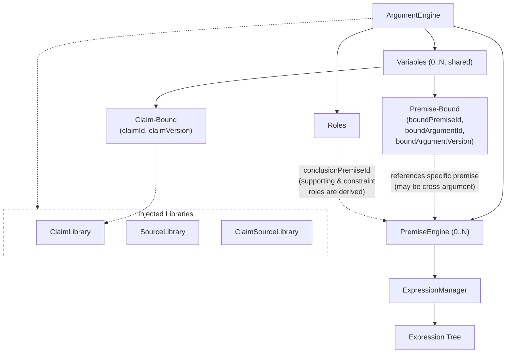
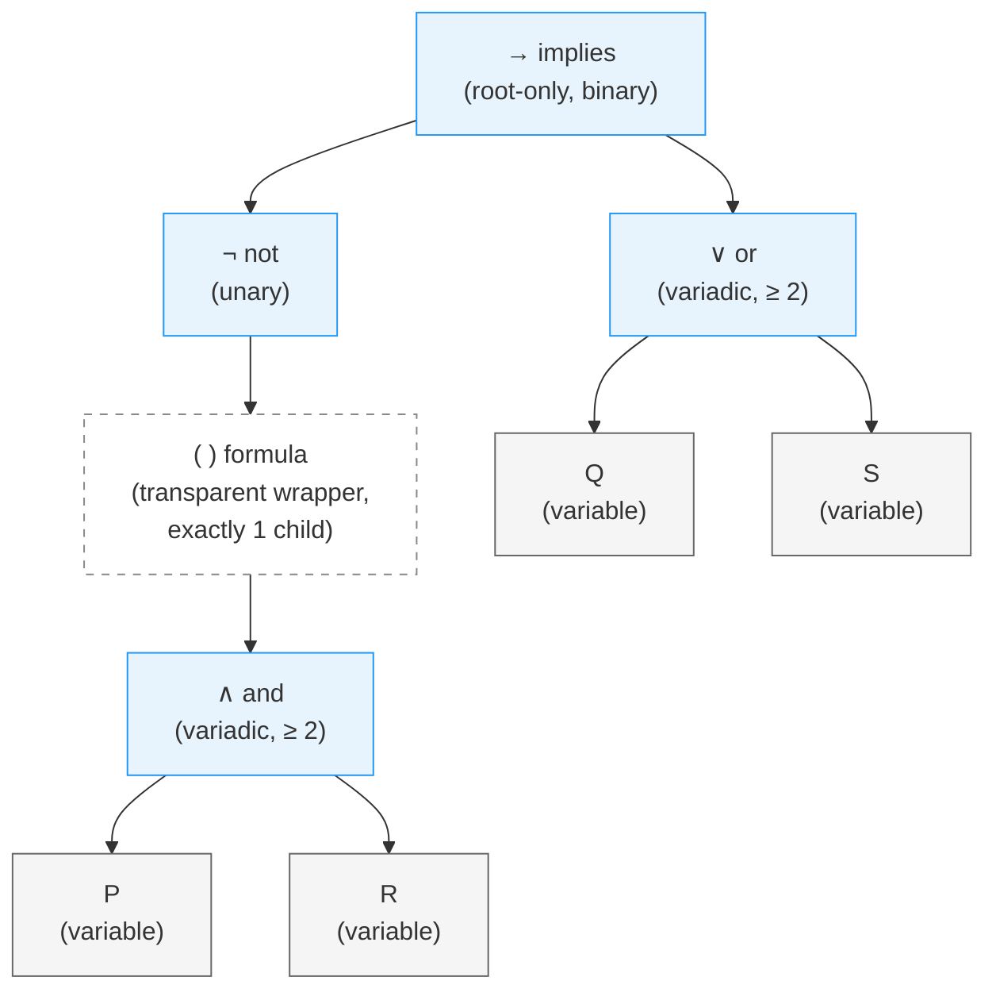
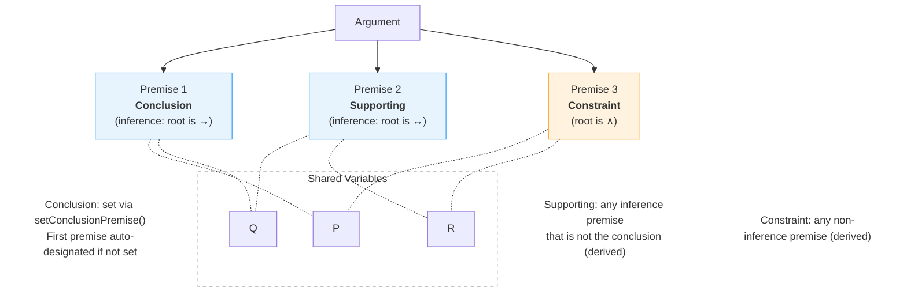
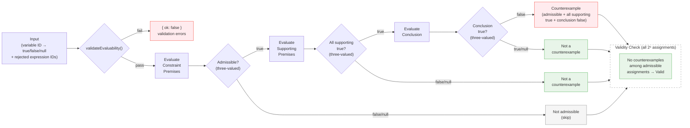

# proposit-core

Core engine for building, evaluating, and checking the logical validity of propositional-logic arguments. Manages typed trees of variables and expressions across one or more **premises**, with strict structural invariants, automatic operator collapse, a display renderer, and a truth-table validity checker.

Also ships a **CLI** (`proposit-core`) for managing arguments, premises, variables, expressions, and analyses stored on disk.

Full documentation is available at <https://proposit-app.github.io/proposit-core/>.

## Visual Overview



## Installation

```bash
pnpm add @proposit/proposit-core
# or
npm install @proposit/proposit-core
```

## Concepts

### Argument

An `ArgumentEngine` is scoped to a single **argument** — a record with an `id`, `version`, `title`, and `description`. Every variable and expression carries a matching `argumentId` and `argumentVersion`; the engine rejects entities that belong to a different argument. Expressions also carry a `premiseId` identifying which premise they belong to, and premises carry `argumentId` and `argumentVersion` for self-describing references.

### Premises

An argument is composed of one or more **premises**, each managed by a `PremiseEngine`. Premises come in two types derived from their root expression:

- **Inference premise** (`"inference"`) — root is `implies` or `iff`. Used as a supporting premise or the conclusion of the argument.
- **Constraint premise** (`"constraint"`) — root is anything else. Restricts which variable assignments are considered admissible without contributing to the inference chain.

### Variables

A **propositional variable** (e.g. `P`, `Q`, `Rain`) is a named atomic proposition. Variables are registered with the `ArgumentEngine` via `addVariable()` and are shared across all premises. Each variable must have a unique `id` and a unique `symbol` within the argument.

### Expressions

An **expression** is a node in the rooted expression tree managed by a `PremiseEngine`. There are three kinds:

- **Variable expression** (`"variable"`) — a leaf node that references a registered variable.
- **Operator expression** (`"operator"`) — an interior node that applies a logical operator to its children.
- **Formula expression** (`"formula"`) — a transparent unary wrapper, equivalent to parentheses around its single child.

The five supported operators and their arities are:

| Operator  | Symbol | Arity          |
| --------- | ------ | -------------- |
| `not`     | ¬      | unary (= 1)    |
| `and`     | ∧      | variadic (≥ 2) |
| `or`      | ∨      | variadic (≥ 2) |
| `implies` | →      | binary (= 2)   |
| `iff`     | ↔      | binary (= 2)   |

`implies` and `iff` are **root-only**: they must have `parentId: null` and cannot be nested inside another expression.

The following diagram shows how the expression `¬(P ∧ R) → (Q ∨ S)` is represented as a tree. Note the formula node — a transparent wrapper equivalent to parentheses — and that `implies` must be the root:



### Argument roles

To evaluate or check an argument, premises must be assigned roles:

- **Conclusion** — the single premise whose truth is being argued for. Set with `ArgumentEngine.setConclusionPremise()`. The first premise added to an engine is automatically designated as the conclusion if none is set; explicit `setConclusionPremise()` overrides this.
- **Supporting** — any inference premise (root is `implies` or `iff`) that is not the conclusion is automatically considered supporting. There is no explicit method to add or remove supporting premises.

A premise that is neither supporting nor the conclusion and whose type is `"constraint"` is automatically used to filter admissible variable assignments during validity checking.

The following diagram shows how premises, roles, and shared variables compose an argument:



### PropositCore

`PropositCore` is the recommended top-level entry point. It creates and wires together all five libraries and provides unified cross-library operations:

```typescript
import { PropositCore } from "@proposit/proposit-core"

const core = new PropositCore()

// Create a claim in the global claim library
const claim = core.claims.create({ id: "claim-1", text: "All men are mortal" })

// Create an argument engine — libraries are wired automatically
const engine = core.arguments.create({
    id: "arg-1",
    version: 0,
    title: "Socrates is mortal",
    description: "",
})

// Fork the argument — clones claims/sources, records provenance
const { engine: forked, remapTable } = core.forkArgument("arg-1", "arg-2")

// Diff with automatic fork-aware entity matching
const diff = core.diffArguments("arg-1", "arg-2")

// Snapshot the entire system state
const snapshot = core.snapshot()
const restored = PropositCore.fromSnapshot(snapshot)
```

`PropositCore` is designed for subclassing. All library fields (`claims`, `sources`, `claimSources`, `forks`, `arguments`) are public and readable. Pass pre-constructed library instances via `TPropositCoreOptions` to inject custom implementations.

### No application metadata

The core library does not deal in user IDs, timestamps, or display text. These are application-level concerns. The CLI adds some metadata (e.g., `createdAt`, `publishedAt`) for its own purposes, but the core schemas are intentionally minimal. Applications extend core entity types via generic parameters.

### Sources

A **source** is an evidentiary reference (paper, article, URL). Source entities live in a global `SourceLibrary` with versioning and freeze semantics (same as `ClaimLibrary`).

Claim-source associations are managed by `ClaimSourceLibrary<TAssoc>` — a standalone global class that links a claim version to a source version. Associations are immutable: create or delete only, no update. `ClaimSourceLibrary` validates both the claim and source references on `add()`.

The `@proposit/proposit-core/extensions/ieee` subpath export provides `IEEESourceSchema` — an extended source type with IEEE citation reference schemas covering 33 reference types.

### Auto-variable creation

When a premise is created via `createPremise()` or `createPremiseWithId()`, the engine automatically creates a **premise-bound variable** for it. This variable allows other premises in the same argument to reference the premise's truth value in their expression trees without manual variable setup.

The auto-created variable gets a symbol from an optional `symbol` parameter, or an auto-generated one (`"P0"`, `"P1"`, ...) with collision avoidance. The variable is included in the returned changeset.

### Argument forking

An argument can be **forked** via `PropositCore.forkArgument()` to create an independent copy — useful for responding to, critiquing, or expanding on another author's argument. Forking:

- Creates a new argument with a new ID (version 0)
- Assigns new UUIDs to all premises, expressions, and variables
- Clones all referenced claims and sources (including their claim-source associations)
- Creates fork records in all six `ForkLibrary` namespaces (arguments, premises, expressions, variables, claims, sources)
- Remaps all internal references (expression parent chains, variable bindings, conclusion role, claim references)
- Registers the new engine in `ArgumentLibrary`
- Returns the new engine, a remap table, claim/source remap maps, and the argument fork record

The forked argument is fully independent — mutations don't affect the source. Fork-aware diffing is automatic via `PropositCore.diffArguments()`, which uses `ForkLibrary` records as entity matchers rather than ID-based pairing.

Subclasses can override the public `canFork()` method to restrict which arguments may be forked (e.g., only published versions). For low-level forking without orchestration, use the standalone `forkArgumentEngine()` function.

### Cross-argument variable binding

A variable can reference a premise in a **different** argument via `bindVariableToExternalPremise()`. This enables structured inter-argument reasoning — for example, Rich's response to John's argument can reference John's premises as variables.

External bindings are **evaluator-assigned**: during evaluation they behave like claim-bound variables (the evaluator provides truth values in the assignment). The binding is navigational — it tells readers where the proposition is defined, but the engine doesn't resolve across argument boundaries. External bindings are included as free variables in truth-table generation.

`bindVariableToArgument()` is a convenience for binding to another argument's conclusion premise — the caller provides the conclusion premise ID and the method delegates to `bindVariableToExternalPremise()`.

Subclasses can override the protected `canBind()` method to restrict which external arguments may be referenced (e.g., only published versions).

Each expression carries:

| Field             | Type             | Description                                                |
| ----------------- | ---------------- | ---------------------------------------------------------- |
| `id`              | `string`         | Unique identifier.                                         |
| `argumentId`      | `string`         | Must match the engine's argument.                          |
| `argumentVersion` | `number`         | Must match the engine's argument version.                  |
| `premiseId`       | `string`         | ID of the premise this expression belongs to.              |
| `parentId`        | `string \| null` | ID of the parent operator, or `null` for root nodes.       |
| `position`        | `number`         | Numeric position among siblings (midpoint-based ordering). |

## Usage

### Creating an engine and premises

```typescript
import { ArgumentEngine, POSITION_INITIAL } from "@proposit/proposit-core"
import type { TPropositionalExpression } from "@proposit/proposit-core"

// The constructor accepts an argument without checksum — it is computed lazily.
const argument = {
    id: "arg-1",
    version: 1,
    title: "Modus Ponens",
    description: "",
}

const eng = new ArgumentEngine(argument)

const { result: premise1 } = eng.createPremise("P implies Q") // PremiseEngine
const { result: premise2 } = eng.createPremise("P")
const { result: conclusion } = eng.createPremise("Q")
```

### Adding variables and expressions

```typescript
// Variables are passed without checksum — checksums are computed lazily.
const varP = {
    id: "var-p",
    argumentId: "arg-1",
    argumentVersion: 1,
    symbol: "P",
}
const varQ = {
    id: "var-q",
    argumentId: "arg-1",
    argumentVersion: 1,
    symbol: "Q",
}

// Register variables once on the engine — they are shared across all premises
eng.addVariable(varP)
eng.addVariable(varQ)

// Premise 1: P → Q
premise1.addExpression({
    id: "op-implies",
    argumentId: "arg-1",
    argumentVersion: 1,
    type: "operator",
    operator: "implies",
    parentId: null,
    position: POSITION_INITIAL,
})
premise1.addExpression({
    id: "expr-p1",
    argumentId: "arg-1",
    argumentVersion: 1,
    type: "variable",
    variableId: "var-p",
    parentId: "op-implies",
    position: 0,
})
premise1.addExpression({
    id: "expr-q",
    argumentId: "arg-1",
    argumentVersion: 1,
    type: "variable",
    variableId: "var-q",
    parentId: "op-implies",
    position: 1,
})

console.log(premise1.toDisplayString()) // (P → Q)

// Premise 2: P
premise2.addExpression({
    id: "expr-p2",
    argumentId: "arg-1",
    argumentVersion: 1,
    type: "variable",
    variableId: "var-p",
    parentId: null,
    position: POSITION_INITIAL,
})

// Conclusion: Q
conclusion.addExpression({
    id: "expr-q2",
    argumentId: "arg-1",
    argumentVersion: 1,
    type: "variable",
    variableId: "var-q",
    parentId: null,
    position: POSITION_INITIAL,
})
```

### Setting roles

```typescript
// The first premise created is automatically designated as the conclusion.
// Supporting premises are derived automatically — any inference premise
// (root is implies/iff) that isn't the conclusion is automatically supporting.
// Use setConclusionPremise to override the auto-assigned conclusion:
eng.setConclusionPremise(conclusion.getId())
```

### Mutation results

All mutating methods on `PremiseEngine` and `ArgumentEngine` return `TCoreMutationResult<T>`, which wraps the direct result with an entity-typed changeset:

```typescript
const { result: pm, changes } = eng.createPremise("My premise")
// pm is a PremiseEngine
// changes.premises?.added contains the new premise data

const { result: expr, changes: exprChanges } = pm.addExpression({
    id: "expr-1",
    argumentId: "arg-1",
    argumentVersion: 1,
    type: "variable",
    variableId: "var-p",
    parentId: null,
    position: POSITION_INITIAL,
})
// exprChanges.expressions?.added contains the new expression
```

### Evaluating an argument

The evaluation pipeline proceeds as follows:



Assignments use `TCoreExpressionAssignment`, which carries both variable truth values (three-valued: `true`, `false`, or `null` for unknown) and operator assignments (three-state: `"accepted"`, `"rejected"`, or absent for normal evaluation):

```typescript
const result = eng.evaluate({
    variables: { "var-p": true, "var-q": true },
    operatorAssignments: {},
})
if (result.ok) {
    console.log(result.conclusionTrue) // true
    console.log(result.allSupportingPremisesTrue) // true
    console.log(result.isCounterexample) // false
}
```

### Checking validity

```typescript
const validity = eng.checkValidity()
if (validity.ok) {
    console.log(validity.isValid) // true (Modus Ponens is valid)
    console.log(validity.counterexamples) // []
}
```

### Using with React

`ArgumentEngine` implements the `useSyncExternalStore` contract, so it works as a React external store with no additional dependencies:

```tsx
import { useSyncExternalStore } from "react"
import { ArgumentEngine } from "@proposit/proposit-core"

// Create the engine outside of React (or in a ref/context)
const engine = new ArgumentEngine({ id: "arg-1", version: 1 })

function ArgumentView() {
    // Subscribe to the full snapshot
    const snapshot = useSyncExternalStore(engine.subscribe, engine.getSnapshot)

    return (
        <div>
            <h2>Variables</h2>
            <ul>
                {Object.values(snapshot.variables).map((v) => (
                    <li key={v.id}>{v.symbol}</li>
                ))}
            </ul>
            <h2>Premises</h2>
            {Object.entries(snapshot.premises).map(([id, p]) => (
                <div key={id}>
                    Premise {id} — {Object.keys(p.expressions).length}{" "}
                    expressions
                </div>
            ))}
        </div>
    )
}
```

For fine-grained reactivity, select a specific slice — React skips re-rendering if the reference is unchanged thanks to structural sharing:

```tsx
function ExpressionView({
    premiseId,
    expressionId,
}: {
    premiseId: string
    expressionId: string
}) {
    // Only re-renders when THIS expression changes
    const expression = useSyncExternalStore(
        engine.subscribe,
        () =>
            engine.getSnapshot().premises[premiseId]?.expressions[expressionId]
    )

    if (!expression) return null
    return (
        <span>
            {expression.type === "variable"
                ? expression.variableId
                : expression.operator}
        </span>
    )
}
```

Mutations go through the engine as usual — subscribers are notified automatically:

```tsx
function AddVariableButton() {
    return (
        <button
            onClick={() => {
                engine.addVariable({
                    id: crypto.randomUUID(),
                    argumentId: "arg-1",
                    argumentVersion: 1,
                    symbol: "R",
                })
            }}
        >
            Add variable R
        </button>
    )
}
```

---

### Inserting an expression into the tree

`insertExpression` splices a new node between existing nodes. The new expression inherits the **anchor** node's current slot in the tree (`leftNodeId ?? rightNodeId`).

```typescript
// Extend  P → Q  into  (P ∧ R) → Q  by inserting an `and` above expr-p1.
const varR = {
    id: "var-r",
    argumentId: "arg-1",
    argumentVersion: 1,
    symbol: "R",
}
eng.addVariable(varR)
premise1.addExpression({
    id: "expr-r",
    argumentId: "arg-1",
    argumentVersion: 1,
    type: "variable",
    variableId: "var-r",
    parentId: null,
    position: POSITION_INITIAL,
})
premise1.insertExpression(
    {
        id: "op-and",
        argumentId: "arg-1",
        argumentVersion: 1,
        type: "operator",
        operator: "and",
        parentId: null, // overwritten by insertExpression
        position: POSITION_INITIAL,
    },
    "expr-p1", // becomes child at position 0
    "expr-r" // becomes child at position 1
)

console.log(premise1.toDisplayString()) // ((P ∧ R) → Q)
```

### Removing expressions

Removing an expression also removes its entire descendant subtree. After the subtree is gone, ancestor operators left with fewer than two children are automatically collapsed:

- **0 children remaining** — the operator is deleted; the check recurses upward.
- **1 child remaining** — the operator is deleted and that child is promoted into the operator's former slot.

```typescript
// Remove expr-r from the and-cluster.
// op-and now has only expr-p1 → op-and is deleted, expr-p1 is promoted back
// to position 0 under op-implies.
premise1.removeExpression("expr-r")

console.log(premise1.toDisplayString()) // (P → Q)
```

### Forking an argument

```typescript
// Fork John's argument to create Rich's response
import { PropositCore } from "@proposit/proposit-core"

const core = new PropositCore()

// Create John's argument (engine registered in core.arguments)
const johnEngine = core.arguments.create({
    id: "john-arg-id",
    version: 1,
    title: "John's argument",
    description: "",
})
// ... populate with premises, variables, expressions ...

// Fork — clones claims/sources, creates fork records, registers new engine
const { engine: richArg, remapTable } = core.forkArgument(
    "john-arg-id",
    "rich-arg-id"
)

// Rich now has a mutable copy — modify, add, or remove premises
const forkedPremiseId = remapTable.premises.get(originalPremiseId)!
richArg.removePremise(forkedPremiseId) // reject a premise
richArg.createPremise(undefined, "RichNewPremise") // add a new one

// See what Rich changed relative to John's original (fork-aware matching is automatic)
const diff = core.diffArguments("john-arg-id", "rich-arg-id")
// diff.premises.removed — premises Rich rejected
// diff.premises.added — premises Rich introduced
// diff.premises.modified — premises Rich altered
```

### Cross-argument variable binding

```typescript
// Rich's argument references a premise from John's argument
richArg.bindVariableToExternalPremise({
    id: "v-john-p2",
    argumentId: "rich-arg-id",
    argumentVersion: 0,
    symbol: "JohnP2",
    boundPremiseId: "johns-premise-2-id",
    boundArgumentId: "johns-arg-id",
    boundArgumentVersion: 2, // must be a published version
})

// Or reference John's conclusion directly
richArg.bindVariableToArgument(
    {
        id: "v-john-conclusion",
        argumentId: "rich-arg-id",
        argumentVersion: 0,
        symbol: "JohnConclusion",
        boundArgumentId: "johns-arg-id",
        boundArgumentVersion: 2,
    },
    "johns-conclusion-premise-id" // caller resolves the conclusion
)

// External bindings are evaluator-assigned — provide truth values in the assignment
const result = richArg.evaluate({
    variables: { "v-john-p2": true, "v-john-conclusion": false },
    operatorAssignments: {},
})
```

## Invalid Constructions and How They're Handled

The engine enforces structural invariants at two levels: **construction-time** (throws immediately) and **validation-time** (detected by `validateEvaluability()` before evaluation). The tables below list every invalid construction.

### Expression tree — prevented at construction time

| Invalid construction                                                             | What happens                                                                                               |
| -------------------------------------------------------------------------------- | ---------------------------------------------------------------------------------------------------------- |
| `implies` or `iff` with `parentId !== null`                                      | Throws — root-only operators must be the root of a premise's tree                                          |
| Non-`not` operator as direct child of another operator                           | Throws — a `formula` node must sit between them (unless `autoNormalize` is `true`, which auto-inserts one) |
| Expression with `parentId === id` (self-parentage)                               | Throws                                                                                                     |
| Duplicate expression ID within a premise                                         | Throws                                                                                                     |
| Expression references a non-existent `parentId`                                  | Throws                                                                                                     |
| Expression's parent is a `variable` expression                                   | Throws — only operators and formulas can have children                                                     |
| `formula` node already has a child (adding a second)                             | Throws — formulas allow exactly one child                                                                  |
| `not` operator already has a child (adding a second)                             | Throws — `not` is unary                                                                                    |
| `implies` or `iff` already has two children (adding a third)                     | Throws — binary operators require exactly two                                                              |
| Two siblings share the same `position` under the same parent                     | Throws                                                                                                     |
| `insertExpression` with `leftNodeId === rightNodeId`                             | Throws                                                                                                     |
| `insertExpression` or `wrapExpression` targeting a root-only operator as a child | Throws — `implies`/`iff` cannot be subordinated                                                            |
| `wrapExpression` with `not` as the wrapping operator                             | Throws — `not` is unary but wrapping always produces two children                                          |
| Expression's `argumentId`/`argumentVersion` doesn't match the premise            | Throws                                                                                                     |

### Expression tree — detected by validation

| Invalid construction                                                  | Error code                      |
| --------------------------------------------------------------------- | ------------------------------- |
| `and` or `or` operator with fewer than 2 children                     | `EXPR_CHILD_COUNT_INVALID`      |
| `not` or `formula` with 0 children                                    | `EXPR_CHILD_COUNT_INVALID`      |
| `implies` or `iff` without exactly 2 children with distinct positions | `EXPR_BINARY_POSITIONS_INVALID` |
| Expression references an undeclared variable                          | `EXPR_VARIABLE_UNDECLARED`      |

### Variables — prevented at construction time

| Invalid construction                                                                    | What happens                                                            |
| --------------------------------------------------------------------------------------- | ----------------------------------------------------------------------- |
| Duplicate variable `id`                                                                 | Throws                                                                  |
| Duplicate variable `symbol`                                                             | Throws                                                                  |
| Variable `argumentId`/`argumentVersion` doesn't match the engine                        | Throws                                                                  |
| Claim-bound variable references a non-existent claim/version                            | Throws                                                                  |
| Premise-bound variable references a non-existent premise (internal)                     | Throws                                                                  |
| Adding a premise-bound variable via `addVariable()`                                     | Throws — use `bindVariableToPremise` or `bindVariableToExternalPremise` |
| Circular binding (variable → premise → expression → variable, transitively)             | Throws                                                                  |
| `bindVariableToPremise` with `boundArgumentId !== engine.argumentId`                    | Throws — use `bindVariableToExternalPremise` for cross-argument         |
| `bindVariableToExternalPremise` with `boundArgumentId === engine.argumentId`            | Throws — use `bindVariableToPremise` for internal                       |
| External binding rejected by `canBind()` policy                                         | Throws                                                                  |
| Renaming a variable to a symbol already in use                                          | Throws                                                                  |
| Changing a variable's binding type (claim → premise or vice versa) via `updateVariable` | Throws — delete and re-create                                           |

### Variables — detected by validation

| Invalid construction                               | Error code                 | Severity |
| -------------------------------------------------- | -------------------------- | -------- |
| Premise-bound variable references an empty premise | `EXPR_BOUND_PREMISE_EMPTY` | Warning  |

### Premises — prevented at construction time

| Invalid construction                                            | What happens |
| --------------------------------------------------------------- | ------------ |
| Duplicate premise ID                                            | Throws       |
| Adding a second root expression (`parentId: null`) to a premise | Throws       |

### Premises — detected by validation

| Invalid construction                             | Error code              |
| ------------------------------------------------ | ----------------------- |
| Premise has no expressions                       | `PREMISE_EMPTY`         |
| Premise has expressions but no root              | `PREMISE_ROOT_MISSING`  |
| `rootExpressionId` doesn't match the actual root | `PREMISE_ROOT_MISMATCH` |

### Argument — detected by validation

| Invalid construction                                        | Error code                             |
| ----------------------------------------------------------- | -------------------------------------- |
| No conclusion premise designated                            | `ARGUMENT_NO_CONCLUSION`               |
| Conclusion premise ID points to a non-existent premise      | `ARGUMENT_CONCLUSION_NOT_FOUND`        |
| Same variable ID used with multiple symbols across premises | `ARGUMENT_VARIABLE_ID_SYMBOL_MISMATCH` |
| Same variable symbol used with multiple IDs across premises | `ARGUMENT_VARIABLE_SYMBOL_AMBIGUOUS`   |

### Removal cascades

These are not errors — they're intentional structural maintenance:

| Trigger                | Cascade behavior                                                                                                                                                                                                                                    |
| ---------------------- | --------------------------------------------------------------------------------------------------------------------------------------------------------------------------------------------------------------------------------------------------- |
| `removeVariable(id)`   | All expressions referencing the variable are deleted across all premises, triggering operator collapse                                                                                                                                              |
| `removePremise(id)`    | All variables bound to the premise are removed (which cascades to their expressions). If the premise was the conclusion, the conclusion becomes unset.                                                                                              |
| `removeExpression(id)` | The expression's subtree is deleted. Ancestor operators with 0 remaining children are deleted. Operators with 1 remaining child promote that child into their slot (operator collapse). Promotions are checked against nesting and root-only rules. |

### Grammar configuration

Two options on `grammarConfig` control expression tree strictness:

| Option                           | Default | Effect                                                                                                                                                                                                                         |
| -------------------------------- | ------- | ------------------------------------------------------------------------------------------------------------------------------------------------------------------------------------------------------------------------------ |
| `enforceFormulaBetweenOperators` | `true`  | When `true`, non-`not` operators cannot be direct children of operators — a `formula` buffer is required.                                                                                                                      |
| `autoNormalize`                  | `false` | When `true`, `addExpression` auto-inserts `formula` buffers instead of throwing. Only applies to `addExpression` and `loadExpressions` — `insertExpression`, `wrapExpression`, and `removeExpression` always enforce or throw. |

`PERMISSIVE_GRAMMAR_CONFIG` (`{ enforceFormulaBetweenOperators: false, autoNormalize: false }`) is used by `fromSnapshot`/`fromData` to load previously saved trees without re-validation.

## API Reference

See [docs/api-reference.md](docs/api-reference.md) for the full API reference covering `ArgumentEngine`, `PremiseEngine`, standalone functions, position utilities, and types.

## CLI

The package ships a command-line interface for managing arguments stored on disk.

### Running the CLI

```bash
# From the repo, using node directly:
node dist/cli.js --help

# Using the npm script:
pnpm cli -- --help

# Link globally to get the `proposit-core` command on your PATH:
pnpm link --global
proposit-core --help
```

### State storage

All data is stored under `~/.proposit-core` by default. Override with the `PROPOSIT_HOME` environment variable:

```bash
PROPOSIT_HOME=/path/to/data proposit-core arguments list
```

The on-disk layout is:

```
$PROPOSIT_HOME/
  arguments/
    <argument-id>/
      meta.json          # id, title, description
      <version>/         # one directory per version (0, 1, 2, …)
        meta.json        # version, createdAt, published, publishedAt?
        variables.json   # array of TPropositionalVariable
        roles.json       # { conclusionPremiseId? }
        premises/
          <premise-id>/
            meta.json    # id, title?
            data.json    # type, rootExpressionId?, variables[], expressions[]
        <analysis>.json  # named analysis files (default: analysis.json)
```

### Versioning

Arguments start at version `0`. Publishing marks the current version as immutable and copies its state to a new draft version. All mutating commands reject published versions.

Version selectors accepted anywhere a `<version>` is required:

| Selector         | Resolves to                            |
| ---------------- | -------------------------------------- |
| `0`, `1`, …      | Exact version number                   |
| `latest`         | Highest version number                 |
| `last-published` | Highest version with `published: true` |

### Top-level commands

```
proposit-core version                              Print the package version
proposit-core arguments create <title> <desc>      Create a new argument (prints UUID)
proposit-core arguments list [--json]              List all arguments
proposit-core arguments delete [--all] [--confirm] <id>   Delete an argument or its latest version
proposit-core arguments publish <id>               Publish latest version, prepare new draft
proposit-core arguments parse [text] [options]     Parse natural language into an argument via LLM
proposit-core arguments import <yaml_file>         Import an argument from YAML
proposit-core claims list [--json]                 List all claims
proposit-core claims show <claim_id> [--json]      Show all versions of a claim
proposit-core claims add [--title <t>] [--body <b>]  Create a new claim
proposit-core claims update <claim_id> [--title <t>] [--body <b>]  Update claim metadata
proposit-core claims freeze <claim_id>             Freeze current version
proposit-core sources list [--json]                List all sources
proposit-core sources show <source_id> [--json]    Show all versions of a source
proposit-core sources add --text <text>            Create a new source
proposit-core sources link-claim <source_id> <claim_id>  Link a source to a claim
proposit-core sources unlink <association_id>      Remove a claim-source association
```

By default `delete` removes only the latest version. Pass `--all` to remove the argument entirely. Both `delete` and `delete-unused` prompt for confirmation unless `--confirm` is supplied.

### Version-scoped commands

All commands below are scoped to a specific argument version:

```
proposit-core <argument_id> <version> <group> <subcommand> [args] [options]
```

#### show

```
proposit-core <id> <ver> show [--json]
```

Displays argument metadata (id, title, description, version, createdAt, published, publishedAt).

#### render

```
proposit-core <id> <ver> render
```

Renders the full argument with metadata. Output includes:

- **Argument header** — title and description
- **Premises** — one per line with formula display string and title (if present); conclusion marked with `*`
- **Variables** — symbol and bound claim title (or premise binding)
- **Claims** — ID, version, frozen status, title, and body
- **Sources** — ID, version, and text

Display strings use standard logical notation (¬ ∧ ∨ → ↔).

#### graph

```
proposit-core <id> <ver> graph [--json] [--analysis <filename>]
```

Outputs the argument as a DOT (Graphviz) directed graph. Pipe the output to `dot` to produce images:

```bash
proposit-core <id> <ver> graph | dot -Tsvg -o argument.svg
proposit-core <id> <ver> graph | dot -Tpng -o argument.png
```

The graph includes:

- **Premise clusters** — one subgraph per premise containing its expression tree; conclusion premise highlighted with bold red border
- **Expression nodes** — operators (diamond), formula wrappers (ellipse), variable references (box)
- **Variable definitions** — claim-bound (yellow) and premise-bound (blue) with binding details
- **Cross-premise edges** — premise-bound variables link to their bound premise cluster

With `--analysis <filename>`, evaluation results from an analysis file are overlaid:

- Expression nodes colored by truth value (green = true, red = false, gray = unknown)
- Rejected expressions marked with double border
- Premise cluster borders colored by root expression truth value
- Graph subtitle shows evaluation summary (admissible, counterexample, preserves truth)

#### roles

```
proposit-core <id> <ver> roles show [--json]
proposit-core <id> <ver> roles set-conclusion <premise_id>
proposit-core <id> <ver> roles clear-conclusion
```

Supporting premises are derived automatically from expression type (inference premises that are not the conclusion).

#### variables

```
proposit-core <id> <ver> variables create <symbol> [--id <variable_id>]
proposit-core <id> <ver> variables list [--json]
proposit-core <id> <ver> variables show <variable_id> [--json]
proposit-core <id> <ver> variables update <variable_id> --symbol <new_symbol>
proposit-core <id> <ver> variables delete <variable_id>
proposit-core <id> <ver> variables list-unused [--json]
proposit-core <id> <ver> variables delete-unused [--confirm] [--json]
```

`create` prints the new variable's UUID. `delete` cascade-deletes all expressions referencing the variable across every premise (including subtree deletion and operator collapse). `delete-unused` removes variables not referenced by any expression in any premise.

#### premises

```
proposit-core <id> <ver> premises create [--title <title>]
proposit-core <id> <ver> premises list [--json]
proposit-core <id> <ver> premises show <premise_id> [--json]
proposit-core <id> <ver> premises update <premise_id> --title <title>
proposit-core <id> <ver> premises delete [--confirm] <premise_id>
proposit-core <id> <ver> premises render <premise_id>
```

`create` prints the new premise's UUID. `render` outputs the expression tree as a display string (e.g. `(P → Q)`).

#### expressions

```
proposit-core <id> <ver> expressions create <premise_id> --type <type> [options]
proposit-core <id> <ver> expressions insert <premise_id> --type <type> [options]
proposit-core <id> <ver> expressions delete <premise_id> <expression_id>
proposit-core <id> <ver> expressions list <premise_id> [--json]
proposit-core <id> <ver> expressions show <premise_id> <expression_id> [--json]
```

Common options for `create` and `insert`:

| Option               | Description                                                            |
| -------------------- | ---------------------------------------------------------------------- |
| `--type <type>`      | `variable`, `operator`, or `formula` (required)                        |
| `--id <id>`          | Explicit expression ID (default: generated UUID)                       |
| `--parent-id <id>`   | Parent expression ID (omit for root)                                   |
| `--position <n>`     | Explicit numeric position (low-level escape hatch)                     |
| `--before <id>`      | Insert before this sibling (computes position automatically)           |
| `--after <id>`       | Insert after this sibling (computes position automatically)            |
| `--variable-id <id>` | Variable ID (required for `type=variable`)                             |
| `--operator <op>`    | `not`, `and`, `or`, `implies`, or `iff` (required for `type=operator`) |

When none of `--position`, `--before`, or `--after` is specified, the expression is appended as the last child of the parent. `--before`/`--after` cannot be combined with `--position`.

`insert` additionally accepts `--left-node-id` and `--right-node-id` to splice the new expression between existing nodes.

#### analysis

An **analysis file** stores a variable assignment (symbol → boolean) for a specific argument version.

```
proposit-core <id> <ver> analysis create [filename] [--default <true|false>]
proposit-core <id> <ver> analysis list [--json]
proposit-core <id> <ver> analysis show [--file <filename>] [--json]
proposit-core <id> <ver> analysis set <symbol> <true|false> [--file <filename>]
proposit-core <id> <ver> analysis reset [--file <filename>] [--value <true|false>]
proposit-core <id> <ver> analysis reject <expression_id> [--file <filename>]
proposit-core <id> <ver> analysis accept <expression_id> [--file <filename>]
proposit-core <id> <ver> analysis validate-assignments [--file <filename>] [--json]
proposit-core <id> <ver> analysis delete [--file <filename>] [--confirm]
proposit-core <id> <ver> analysis evaluate [--file <filename>] [options]
proposit-core <id> <ver> analysis check-validity [options]
proposit-core <id> <ver> analysis validate-argument [--json]
proposit-core <id> <ver> analysis refs [--json]
proposit-core <id> <ver> analysis export [--json]
```

`--file` defaults to `analysis.json` throughout. Key subcommands:

- **`reject`** — marks an expression as rejected (it will evaluate to `false` and its children are skipped).
- **`accept`** — removes an expression from the rejected list (restores normal computation).
- **`evaluate`** — resolves symbol→ID, evaluates the argument, reports admissibility, counterexample status, and whether the conclusion is true.
- **`check-validity`** — runs the full truth-table search (`--mode first-counterexample|exhaustive`).
- **`validate-argument`** — checks structural readiness (conclusion set, inference premises, etc.).
- **`refs`** — lists every variable referenced across all premises.
- **`export`** — dumps the full `ArgumentEngine` state as JSON (uses `snapshot()` internally).

### Logging

All CLI invocations are logged to `~/.proposit-core/logs/cli.jsonl` (or `$PROPOSIT_HOME/logs/cli.jsonl`). Each line is a JSON object with a timestamp and event name. The `arguments parse` command additionally logs the full LLM request and response, plus dedicated error entries for validation and build failures.

## Development

```bash
pnpm install
pnpm run typecheck   # type-check without emitting
pnpm run lint        # Prettier + ESLint
pnpm run test        # Vitest
pnpm run build       # compile to dist/
pnpm run check       # all of the above in sequence
pnpm cli -- --help   # run the CLI from the local build
```

A CLI smoke test exercises every command against an isolated temp directory:

```bash
pnpm run build && bash scripts/smoke-test.sh
```

See [CLI_EXAMPLES.md](CLI_EXAMPLES.md) for a full walkthrough.

## Publishing

Releases are published to GitHub Packages automatically. To publish a new version:

1. Bump `version` in `package.json`.
2. Create a GitHub Release with a tag matching the version (e.g. `v0.2.0`) via `pnpm version patch`
3. The [Publish workflow](.github/workflows/publish.yml) will build and publish the package or run `pnpm publish --access public`
4. Push new tags with `git push --follow-tags`
