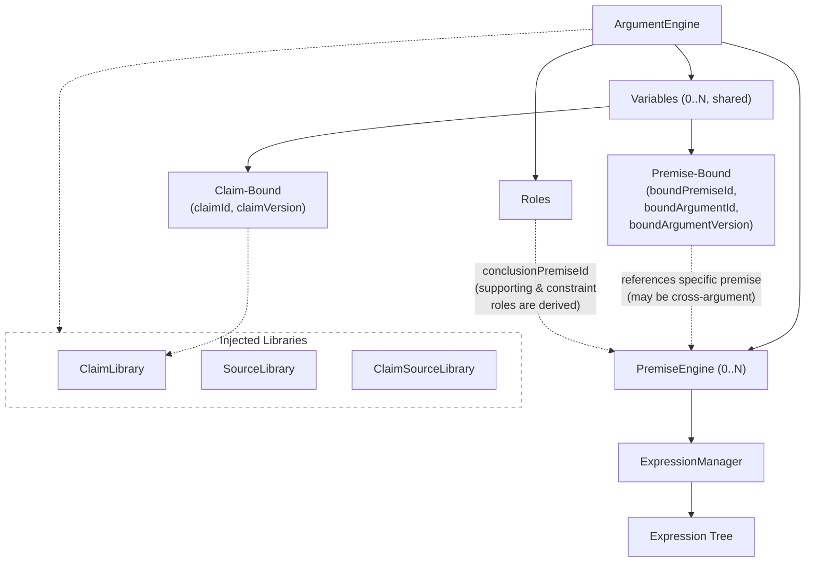
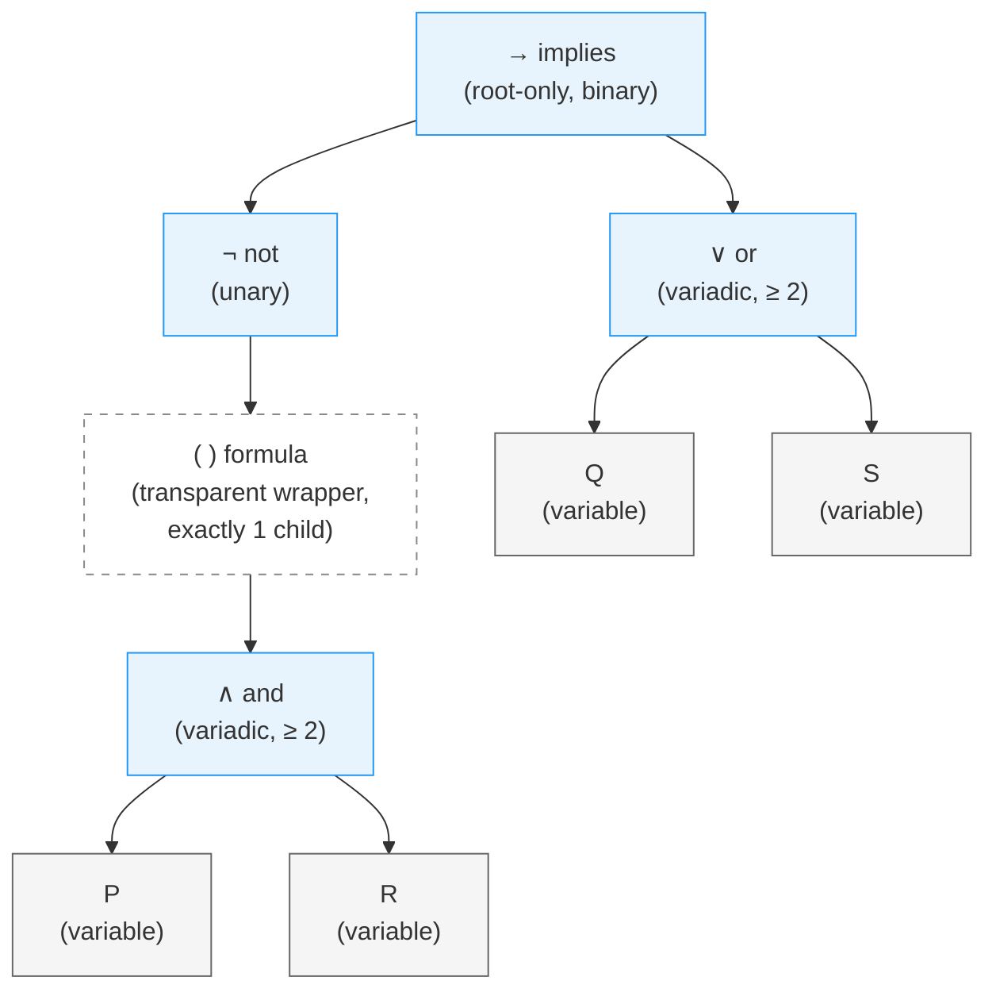
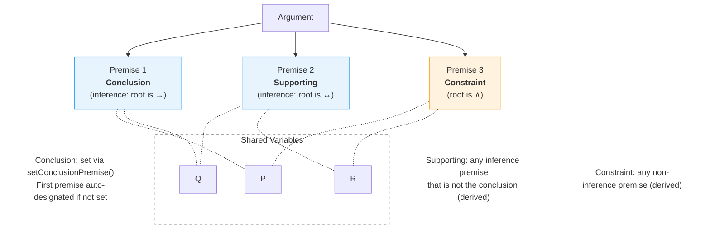
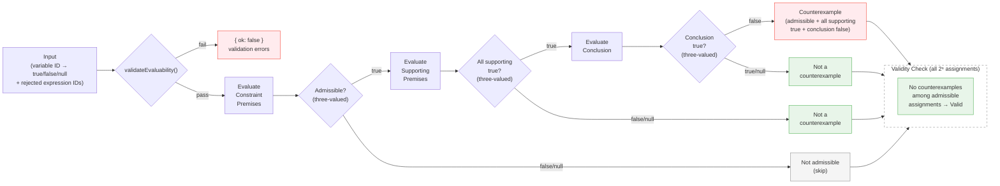

# proposit-core

Core engine for building, evaluating, and checking the logical validity of propositional-logic arguments. Manages typed trees of variables and expressions across one or more **premises**, with strict structural invariants, automatic operator collapse, a display renderer, and a truth-table validity checker.

Also ships a **CLI** (`proposit-core`) for managing arguments, premises, variables, expressions, and analyses stored on disk.

## Visual Overview



## Installation

```bash
pnpm add @polintpro/proposit-core
# or
npm install @polintpro/proposit-core
```

## Concepts

### Argument

An `ArgumentEngine` is scoped to a single **argument** — a record with an `id`, `version`, `title`, and `description`. Every variable and expression carries a matching `argumentId` and `argumentVersion`; the engine rejects entities that belong to a different argument. Expressions also carry a `premiseId` identifying which premise they belong to, and premises carry `argumentId` and `argumentVersion` for self-describing references.

### Premises

An argument is composed of one or more **premises**, each managed by a `PremiseEngine`. Premises come in two types derived from their root expression:

- **Inference premise** (`"inference"`) — root is `implies` or `iff`. Used as a supporting premise or the conclusion of the argument.
- **Constraint premise** (`"constraint"`) — root is anything else. Restricts which variable assignments are considered admissible without contributing to the inference chain.

### Variables

A **propositional variable** (e.g. `P`, `Q`, `Rain`) is a named atomic proposition. Variables are registered with the `ArgumentEngine` via `addVariable()` and are shared across all premises. Each variable must have a unique `id` and a unique `symbol` within the argument.

### Expressions

An **expression** is a node in the rooted expression tree managed by a `PremiseEngine`. There are three kinds:

- **Variable expression** (`"variable"`) — a leaf node that references a registered variable.
- **Operator expression** (`"operator"`) — an interior node that applies a logical operator to its children.
- **Formula expression** (`"formula"`) — a transparent unary wrapper, equivalent to parentheses around its single child.

The five supported operators and their arities are:

| Operator  | Symbol | Arity          |
| --------- | ------ | -------------- |
| `not`     | ¬      | unary (= 1)    |
| `and`     | ∧      | variadic (≥ 2) |
| `or`      | ∨      | variadic (≥ 2) |
| `implies` | →      | binary (= 2)   |
| `iff`     | ↔      | binary (= 2)   |

`implies` and `iff` are **root-only**: they must have `parentId: null` and cannot be nested inside another expression.

The following diagram shows how the expression `¬(P ∧ R) → (Q ∨ S)` is represented as a tree. Note the formula node — a transparent wrapper equivalent to parentheses — and that `implies` must be the root:



### Argument roles

To evaluate or check an argument, premises must be assigned roles:

- **Conclusion** — the single premise whose truth is being argued for. Set with `ArgumentEngine.setConclusionPremise()`. The first premise added to an engine is automatically designated as the conclusion if none is set; explicit `setConclusionPremise()` overrides this.
- **Supporting** — any inference premise (root is `implies` or `iff`) that is not the conclusion is automatically considered supporting. There is no explicit method to add or remove supporting premises.

A premise that is neither supporting nor the conclusion and whose type is `"constraint"` is automatically used to filter admissible variable assignments during validity checking.

The following diagram shows how premises, roles, and shared variables compose an argument:



### Sources

A **source** is an evidentiary reference (paper, article, URL). Source entities live in a global `SourceLibrary` with versioning and freeze semantics (same as `ClaimLibrary`).

Claim-source associations are managed by `ClaimSourceLibrary<TAssoc>` — a standalone global class that links a claim version to a source version. Associations are immutable: create or delete only, no update. `ClaimSourceLibrary` validates both the claim and source references on `add()`.

The `@polintpro/proposit-core/extensions/ieee` subpath export provides `IEEESourceSchema` — an extended source type with IEEE citation reference schemas covering 33 reference types.

Each expression carries:

| Field             | Type             | Description                                                |
| ----------------- | ---------------- | ---------------------------------------------------------- |
| `id`              | `string`         | Unique identifier.                                         |
| `argumentId`      | `string`         | Must match the engine's argument.                          |
| `argumentVersion` | `number`         | Must match the engine's argument version.                  |
| `premiseId`       | `string`         | ID of the premise this expression belongs to.              |
| `parentId`        | `string \| null` | ID of the parent operator, or `null` for root nodes.       |
| `position`        | `number`         | Numeric position among siblings (midpoint-based ordering). |

## Usage

### Creating an engine and premises

```typescript
import { ArgumentEngine, POSITION_INITIAL } from "@polintpro/proposit-core"
import type { TPropositionalExpression } from "@polintpro/proposit-core"

// The constructor accepts an argument without checksum — it is computed lazily.
const argument = {
    id: "arg-1",
    version: 1,
    title: "Modus Ponens",
    description: "",
}

const eng = new ArgumentEngine(argument)

const { result: premise1 } = eng.createPremise("P implies Q") // PremiseEngine
const { result: premise2 } = eng.createPremise("P")
const { result: conclusion } = eng.createPremise("Q")
```

### Adding variables and expressions

```typescript
// Variables are passed without checksum — checksums are computed lazily.
const varP = {
    id: "var-p",
    argumentId: "arg-1",
    argumentVersion: 1,
    symbol: "P",
}
const varQ = {
    id: "var-q",
    argumentId: "arg-1",
    argumentVersion: 1,
    symbol: "Q",
}

// Register variables once on the engine — they are shared across all premises
eng.addVariable(varP)
eng.addVariable(varQ)

// Premise 1: P → Q
premise1.addExpression({
    id: "op-implies",
    argumentId: "arg-1",
    argumentVersion: 1,
    type: "operator",
    operator: "implies",
    parentId: null,
    position: POSITION_INITIAL,
})
premise1.addExpression({
    id: "expr-p1",
    argumentId: "arg-1",
    argumentVersion: 1,
    type: "variable",
    variableId: "var-p",
    parentId: "op-implies",
    position: 0,
})
premise1.addExpression({
    id: "expr-q",
    argumentId: "arg-1",
    argumentVersion: 1,
    type: "variable",
    variableId: "var-q",
    parentId: "op-implies",
    position: 1,
})

console.log(premise1.toDisplayString()) // (P → Q)

// Premise 2: P
premise2.addExpression({
    id: "expr-p2",
    argumentId: "arg-1",
    argumentVersion: 1,
    type: "variable",
    variableId: "var-p",
    parentId: null,
    position: POSITION_INITIAL,
})

// Conclusion: Q
conclusion.addExpression({
    id: "expr-q2",
    argumentId: "arg-1",
    argumentVersion: 1,
    type: "variable",
    variableId: "var-q",
    parentId: null,
    position: POSITION_INITIAL,
})
```

### Setting roles

```typescript
// The first premise created is automatically designated as the conclusion.
// Supporting premises are derived automatically — any inference premise
// (root is implies/iff) that isn't the conclusion is automatically supporting.
// Use setConclusionPremise to override the auto-assigned conclusion:
eng.setConclusionPremise(conclusion.getId())
```

### Mutation results

All mutating methods on `PremiseEngine` and `ArgumentEngine` return `TCoreMutationResult<T>`, which wraps the direct result with an entity-typed changeset:

```typescript
const { result: pm, changes } = eng.createPremise("My premise")
// pm is a PremiseEngine
// changes.premises?.added contains the new premise data

const { result: expr, changes: exprChanges } = pm.addExpression({
    id: "expr-1",
    argumentId: "arg-1",
    argumentVersion: 1,
    type: "variable",
    variableId: "var-p",
    parentId: null,
    position: POSITION_INITIAL,
})
// exprChanges.expressions?.added contains the new expression
```

### Evaluating an argument

The evaluation pipeline proceeds as follows:



Assignments use `TCoreExpressionAssignment`, which carries both variable truth values (three-valued: `true`, `false`, or `null` for unknown) and a list of rejected expression IDs:

```typescript
const result = eng.evaluate({
    variables: { "var-p": true, "var-q": true },
    rejectedExpressionIds: [],
})
if (result.ok) {
    console.log(result.conclusionTrue) // true
    console.log(result.allSupportingPremisesTrue) // true
    console.log(result.isCounterexample) // false
}
```

### Checking validity

```typescript
const validity = eng.checkValidity()
if (validity.ok) {
    console.log(validity.isValid) // true (Modus Ponens is valid)
    console.log(validity.counterexamples) // []
}
```

### Using with React

`ArgumentEngine` implements the `useSyncExternalStore` contract, so it works as a React external store with no additional dependencies:

```tsx
import { useSyncExternalStore } from "react"
import { ArgumentEngine } from "@polintpro/proposit-core"

// Create the engine outside of React (or in a ref/context)
const engine = new ArgumentEngine({ id: "arg-1", version: 1 })

function ArgumentView() {
    // Subscribe to the full snapshot
    const snapshot = useSyncExternalStore(engine.subscribe, engine.getSnapshot)

    return (
        <div>
            <h2>Variables</h2>
            <ul>
                {Object.values(snapshot.variables).map((v) => (
                    <li key={v.id}>{v.symbol}</li>
                ))}
            </ul>
            <h2>Premises</h2>
            {Object.entries(snapshot.premises).map(([id, p]) => (
                <div key={id}>
                    Premise {id} — {Object.keys(p.expressions).length}{" "}
                    expressions
                </div>
            ))}
        </div>
    )
}
```

For fine-grained reactivity, select a specific slice — React skips re-rendering if the reference is unchanged thanks to structural sharing:

```tsx
function ExpressionView({
    premiseId,
    expressionId,
}: {
    premiseId: string
    expressionId: string
}) {
    // Only re-renders when THIS expression changes
    const expression = useSyncExternalStore(
        engine.subscribe,
        () =>
            engine.getSnapshot().premises[premiseId]?.expressions[expressionId]
    )

    if (!expression) return null
    return (
        <span>
            {expression.type === "variable"
                ? expression.variableId
                : expression.operator}
        </span>
    )
}
```

Mutations go through the engine as usual — subscribers are notified automatically:

```tsx
function AddVariableButton() {
    return (
        <button
            onClick={() => {
                engine.addVariable({
                    id: crypto.randomUUID(),
                    argumentId: "arg-1",
                    argumentVersion: 1,
                    symbol: "R",
                })
            }}
        >
            Add variable R
        </button>
    )
}
```

---

### Inserting an expression into the tree

`insertExpression` splices a new node between existing nodes. The new expression inherits the **anchor** node's current slot in the tree (`leftNodeId ?? rightNodeId`).

```typescript
// Extend  P → Q  into  (P ∧ R) → Q  by inserting an `and` above expr-p1.
const varR = {
    id: "var-r",
    argumentId: "arg-1",
    argumentVersion: 1,
    symbol: "R",
}
eng.addVariable(varR)
premise1.addExpression({
    id: "expr-r",
    argumentId: "arg-1",
    argumentVersion: 1,
    type: "variable",
    variableId: "var-r",
    parentId: null,
    position: POSITION_INITIAL,
})
premise1.insertExpression(
    {
        id: "op-and",
        argumentId: "arg-1",
        argumentVersion: 1,
        type: "operator",
        operator: "and",
        parentId: null, // overwritten by insertExpression
        position: POSITION_INITIAL,
    },
    "expr-p1", // becomes child at position 0
    "expr-r" // becomes child at position 1
)

console.log(premise1.toDisplayString()) // ((P ∧ R) → Q)
```

### Removing expressions

Removing an expression also removes its entire descendant subtree. After the subtree is gone, ancestor operators left with fewer than two children are automatically collapsed:

- **0 children remaining** — the operator is deleted; the check recurses upward.
- **1 child remaining** — the operator is deleted and that child is promoted into the operator's former slot.

```typescript
// Remove expr-r from the and-cluster.
// op-and now has only expr-p1 → op-and is deleted, expr-p1 is promoted back
// to position 0 under op-implies.
premise1.removeExpression("expr-r")

console.log(premise1.toDisplayString()) // (P → Q)
```

## API Reference

See [docs/api-reference.md](docs/api-reference.md) for the full API reference covering `ArgumentEngine`, `PremiseEngine`, standalone functions, position utilities, and types.

## CLI

The package ships a command-line interface for managing arguments stored on disk.

### Running the CLI

```bash
# From the repo, using node directly:
node dist/cli.js --help

# Using the npm script:
pnpm cli -- --help

# Link globally to get the `proposit-core` command on your PATH:
pnpm link --global
proposit-core --help
```

### State storage

All data is stored under `~/.proposit-core` by default. Override with the `PROPOSIT_HOME` environment variable:

```bash
PROPOSIT_HOME=/path/to/data proposit-core arguments list
```

The on-disk layout is:

```
$PROPOSIT_HOME/
  arguments/
    <argument-id>/
      meta.json          # id, title, description
      <version>/         # one directory per version (0, 1, 2, …)
        meta.json        # version, createdAt, published, publishedAt?
        variables.json   # array of TPropositionalVariable
        roles.json       # { conclusionPremiseId? }
        premises/
          <premise-id>/
            meta.json    # id, title?
            data.json    # type, rootExpressionId?, variables[], expressions[]
        <analysis>.json  # named analysis files (default: analysis.json)
```

### Versioning

Arguments start at version `0`. Publishing marks the current version as immutable and copies its state to a new draft version. All mutating commands reject published versions.

Version selectors accepted anywhere a `<version>` is required:

| Selector         | Resolves to                            |
| ---------------- | -------------------------------------- |
| `0`, `1`, …      | Exact version number                   |
| `latest`         | Highest version number                 |
| `last-published` | Highest version with `published: true` |

### Top-level commands

```
proposit-core version                              Print the package version
proposit-core arguments create <title> <desc>      Create a new argument (prints UUID)
proposit-core arguments list [--json]              List all arguments
proposit-core arguments delete [--all] [--confirm] <id>   Delete an argument or its latest version
proposit-core arguments publish <id>               Publish latest version, prepare new draft
```

By default `delete` removes only the latest version. Pass `--all` to remove the argument entirely. Both `delete` and `delete-unused` prompt for confirmation unless `--confirm` is supplied.

### Version-scoped commands

All commands below are scoped to a specific argument version:

```
proposit-core <argument_id> <version> <group> <subcommand> [args] [options]
```

#### show

```
proposit-core <id> <ver> show [--json]
```

Displays argument metadata (id, title, description, version, createdAt, published, publishedAt).

#### render

```
proposit-core <id> <ver> render
```

Prints every premise in the argument, one per line, in the format `<premise_id>: <display_string>`. The premise designated as the conclusion is marked with an asterisk (`<premise_id>*: <display_string>`). Display strings use standard logical notation (¬ ∧ ∨ → ↔).

#### roles

```
proposit-core <id> <ver> roles show [--json]
proposit-core <id> <ver> roles set-conclusion <premise_id>
proposit-core <id> <ver> roles clear-conclusion
```

Supporting premises are derived automatically from expression type (inference premises that are not the conclusion).

#### variables

```
proposit-core <id> <ver> variables create <symbol> [--id <variable_id>]
proposit-core <id> <ver> variables list [--json]
proposit-core <id> <ver> variables show <variable_id> [--json]
proposit-core <id> <ver> variables update <variable_id> --symbol <new_symbol>
proposit-core <id> <ver> variables delete <variable_id>
proposit-core <id> <ver> variables list-unused [--json]
proposit-core <id> <ver> variables delete-unused [--confirm] [--json]
```

`create` prints the new variable's UUID. `delete` cascade-deletes all expressions referencing the variable across every premise (including subtree deletion and operator collapse). `delete-unused` removes variables not referenced by any expression in any premise.

#### premises

```
proposit-core <id> <ver> premises create [--title <title>]
proposit-core <id> <ver> premises list [--json]
proposit-core <id> <ver> premises show <premise_id> [--json]
proposit-core <id> <ver> premises update <premise_id> --title <title>
proposit-core <id> <ver> premises delete [--confirm] <premise_id>
proposit-core <id> <ver> premises render <premise_id>
```

`create` prints the new premise's UUID. `render` outputs the expression tree as a display string (e.g. `(P → Q)`).

#### expressions

```
proposit-core <id> <ver> expressions create <premise_id> --type <type> [options]
proposit-core <id> <ver> expressions insert <premise_id> --type <type> [options]
proposit-core <id> <ver> expressions delete <premise_id> <expression_id>
proposit-core <id> <ver> expressions list <premise_id> [--json]
proposit-core <id> <ver> expressions show <premise_id> <expression_id> [--json]
```

Common options for `create` and `insert`:

| Option               | Description                                                            |
| -------------------- | ---------------------------------------------------------------------- |
| `--type <type>`      | `variable`, `operator`, or `formula` (required)                        |
| `--id <id>`          | Explicit expression ID (default: generated UUID)                       |
| `--parent-id <id>`   | Parent expression ID (omit for root)                                   |
| `--position <n>`     | Explicit numeric position (low-level escape hatch)                     |
| `--before <id>`      | Insert before this sibling (computes position automatically)           |
| `--after <id>`       | Insert after this sibling (computes position automatically)            |
| `--variable-id <id>` | Variable ID (required for `type=variable`)                             |
| `--operator <op>`    | `not`, `and`, `or`, `implies`, or `iff` (required for `type=operator`) |

When none of `--position`, `--before`, or `--after` is specified, the expression is appended as the last child of the parent. `--before`/`--after` cannot be combined with `--position`.

`insert` additionally accepts `--left-node-id` and `--right-node-id` to splice the new expression between existing nodes.

#### analysis

An **analysis file** stores a variable assignment (symbol → boolean) for a specific argument version.

```
proposit-core <id> <ver> analysis create [filename] [--default <true|false>]
proposit-core <id> <ver> analysis list [--json]
proposit-core <id> <ver> analysis show [--file <filename>] [--json]
proposit-core <id> <ver> analysis set <symbol> <true|false> [--file <filename>]
proposit-core <id> <ver> analysis reset [--file <filename>] [--value <true|false>]
proposit-core <id> <ver> analysis reject <expression_id> [--file <filename>]
proposit-core <id> <ver> analysis accept <expression_id> [--file <filename>]
proposit-core <id> <ver> analysis validate-assignments [--file <filename>] [--json]
proposit-core <id> <ver> analysis delete [--file <filename>] [--confirm]
proposit-core <id> <ver> analysis evaluate [--file <filename>] [options]
proposit-core <id> <ver> analysis check-validity [options]
proposit-core <id> <ver> analysis validate-argument [--json]
proposit-core <id> <ver> analysis refs [--json]
proposit-core <id> <ver> analysis export [--json]
```

`--file` defaults to `analysis.json` throughout. Key subcommands:

- **`reject`** — marks an expression as rejected (it will evaluate to `false` and its children are skipped).
- **`accept`** — removes an expression from the rejected list (restores normal computation).
- **`evaluate`** — resolves symbol→ID, evaluates the argument, reports admissibility, counterexample status, and whether the conclusion is true.
- **`check-validity`** — runs the full truth-table search (`--mode first-counterexample|exhaustive`).
- **`validate-argument`** — checks structural readiness (conclusion set, inference premises, etc.).
- **`refs`** — lists every variable referenced across all premises.
- **`export`** — dumps the full `ArgumentEngine` state as JSON (uses `snapshot()` internally).

## Development

```bash
pnpm install
pnpm run typecheck   # type-check without emitting
pnpm run lint        # Prettier + ESLint
pnpm run test        # Vitest
pnpm run build       # compile to dist/
pnpm run check       # all of the above in sequence
pnpm cli -- --help   # run the CLI from the local build
```

A CLI smoke test exercises every command against an isolated temp directory:

```bash
pnpm run build && bash scripts/smoke-test.sh
```

See [CLI_EXAMPLES.md](CLI_EXAMPLES.md) for a full walkthrough.

## Publishing

Releases are published to GitHub Packages automatically. To publish a new version:

1. Bump `version` in `package.json`.
2. Create a GitHub Release with a tag matching the version (e.g. `v0.2.0`) via `pnpm version patch`
3. The [Publish workflow](.github/workflows/publish.yml) will build and publish the package or run `pnpm publish --access public`
4. Push new tags with `git push --follow-tags`
