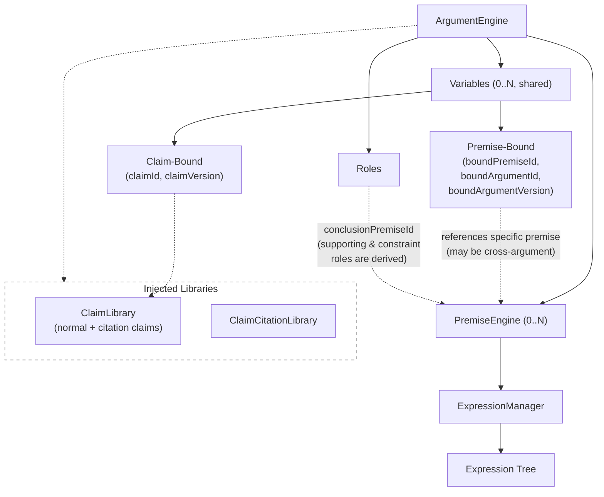
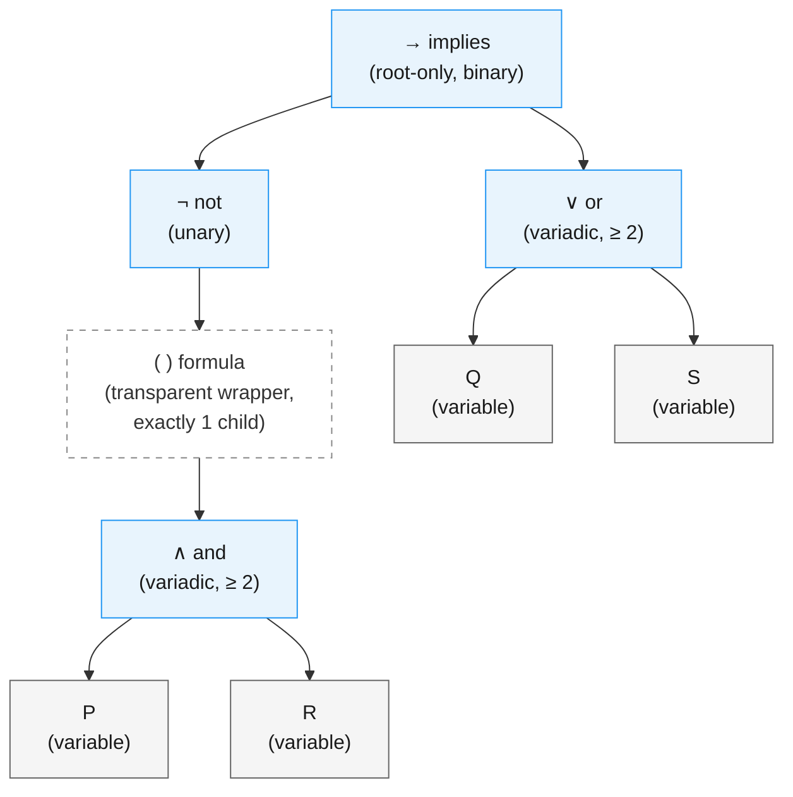
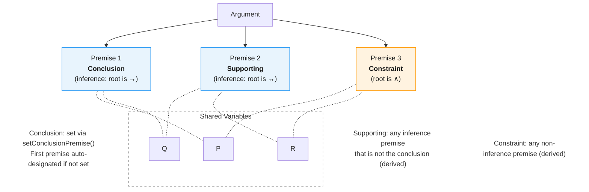
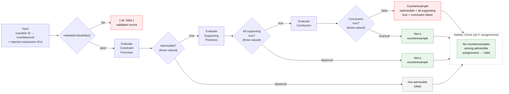

# proposit-core

Core engine for building, evaluating, and checking the logical validity of propositional-logic arguments. Manages typed trees of variables and expressions across one or more **premises**, with strict structural invariants, automatic operator collapse, a display renderer, and a truth-table validity checker.

Also ships a **CLI** (`proposit-core`) for managing arguments, premises, variables, expressions, and analyses stored on disk.

Full documentation is available at <https://proposit-app.github.io/proposit-core/>.

## Visual Overview


```mermaid
flowchart TD
    AE["ArgumentEngine"]

    AE --> PM["PremiseEngine (0..N)"]
    AE --> VM["Variables (0..N, shared)"]
    AE --> Roles["Roles"]

    PM --> EM["ExpressionManager"]
    EM --> ET["Expression Tree"]

    VM --> CBV["Claim-Bound\n(claimId, claimVersion)"]
    VM --> PBV["Premise-Bound\n(boundPremiseId,\nboundArgumentId,\nboundArgumentVersion)"]

    CBV -.-> CL
    PBV -.->|"references specific premise\n(may be cross-argument)"| PM

    Roles -.->|"conclusionPremiseId\n(supporting & constraint\nroles are derived)"| PM

    subgraph Injected["Injected Libraries"]
        CL["ClaimLibrary\n(normal + citation claims)"]
        CCL["ClaimCitationLibrary"]
    end

    AE -.-> Injected

    style Injected fill:none,stroke:#888,stroke-dasharray: 5 5
```

## Installation

```bash
pnpm add @proposit/proposit-core
# or
npm install @proposit/proposit-core
```

## Concepts

### Argument

An `ArgumentEngine` is scoped to a single **argument** — a record with an `id`, `version`, `title`, and `description`. Every variable and expression carries a matching `argumentId` and `argumentVersion`; the engine rejects entities that belong to a different argument. Expressions also carry a `premiseId` identifying which premise they belong to, and premises carry `argumentId` and `argumentVersion` for self-describing references.

### Premises

An argument is composed of one or more **premises**, each managed by a `PremiseEngine`. Premises come in two types derived from their root expression:

- **Inference premise** (`"inference"`) — root is `implies` or `iff`. Used as a supporting premise or the conclusion of the argument.
- **Constraint premise** (`"constraint"`) — root is anything else. Restricts which variable assignments are considered admissible without contributing to the inference chain.

### Variables

A **propositional variable** (e.g. `P`, `Q`, `Rain`) is a named atomic proposition. Variables are registered with the `ArgumentEngine` via `addVariable()` and are shared across all premises. Each variable must have a unique `id` and a unique `symbol` within the argument.

### Expressions

An **expression** is a node in the rooted expression tree managed by a `PremiseEngine`. There are three kinds:

- **Variable expression** (`"variable"`) — a leaf node that references a registered variable.
- **Operator expression** (`"operator"`) — an interior node that applies a logical operator to its children.
- **Formula expression** (`"formula"`) — a transparent unary wrapper, equivalent to parentheses around its single child.

The five supported operators and their arities are:

| Operator  | Symbol | Arity          |
| --------- | ------ | -------------- |
| `not`     | ¬      | unary (= 1)    |
| `and`     | ∧      | variadic (≥ 2) |
| `or`      | ∨      | variadic (≥ 2) |
| `implies` | →      | binary (= 2)   |
| `iff`     | ↔      | binary (= 2)   |

`implies` and `iff` are **root-only**: they must have `parentId: null` and cannot be nested inside another expression.

The following diagram shows how the expression `¬(P ∧ R) → (Q ∨ S)` is represented as a tree. Note the formula node — a transparent wrapper equivalent to parentheses — and that `implies` must be the root:


```mermaid
flowchart TD
    IMP["→ implies\n(root-only, binary)"]

    IMP --> NOT["¬ not\n(unary)"]
    IMP --> OR["∨ or\n(variadic, ≥ 2)"]

    NOT --> FRM["( ) formula\n(transparent wrapper,\nexactly 1 child)"]

    FRM --> AND["∧ and\n(variadic, ≥ 2)"]

    AND --> P["P\n(variable)"]
    AND --> R["R\n(variable)"]

    OR --> Q["Q\n(variable)"]
    OR --> S["S\n(variable)"]

    style IMP fill:#e8f4fd,stroke:#2196f3,color:#1a1a1a
    style NOT fill:#e8f4fd,stroke:#2196f3,color:#1a1a1a
    style AND fill:#e8f4fd,stroke:#2196f3,color:#1a1a1a
    style OR fill:#e8f4fd,stroke:#2196f3,color:#1a1a1a
    style FRM fill:none,stroke:#888,stroke-dasharray: 5 5
    style P fill:#f5f5f5,stroke:#666,color:#1a1a1a
    style R fill:#f5f5f5,stroke:#666,color:#1a1a1a
    style Q fill:#f5f5f5,stroke:#666,color:#1a1a1a
    style S fill:#f5f5f5,stroke:#666,color:#1a1a1a
```

### Argument roles

To evaluate or check an argument, premises must be assigned roles:

- **Conclusion** — the single premise whose truth is being argued for. Set with `ArgumentEngine.setConclusionPremise()`. The first premise added to an engine is automatically designated as the conclusion if none is set; explicit `setConclusionPremise()` overrides this.
- **Supporting** — any inference premise (root is `implies` or `iff`) that is not the conclusion is automatically considered supporting. There is no explicit method to add or remove supporting premises.

A premise that is neither supporting nor the conclusion and whose type is `"constraint"` is automatically used to filter admissible variable assignments during validity checking.

The following diagram shows how premises, roles, and shared variables compose an argument:


```mermaid
flowchart TD
    ARG["Argument"]

    ARG --> P1["Premise 1\n<b>Conclusion</b>\n(inference: root is →)"]
    ARG --> P2["Premise 2\n<b>Supporting</b>\n(inference: root is ↔)"]
    ARG --> P3["Premise 3\n<b>Constraint</b>\n(root is ∧)"]

    subgraph Shared["Shared Variables"]
        VP["P"]
        VQ["Q"]
        VR["R"]
    end

    P1 -.- VP
    P1 -.- VQ
    P2 -.- VQ
    P2 -.- VR
    P3 -.- VP
    P3 -.- VR

    note1["Conclusion: set via setConclusionPremise()\nFirst premise auto-designated if not set"]
    note2["Supporting: any inference premise\nthat is not the conclusion (derived)"]
    note3["Constraint: any non-inference premise (derived)"]

    P1 ~~~ note1
    P2 ~~~ note2
    P3 ~~~ note3

    style P1 fill:#e8f4fd,stroke:#2196f3,color:#1a1a1a
    style P2 fill:#e8f4fd,stroke:#2196f3,color:#1a1a1a
    style P3 fill:#fff3e0,stroke:#ff9800,color:#1a1a1a
    style Shared fill:none,stroke:#888,stroke-dasharray: 5 5
    style note1 fill:none,stroke:none
    style note2 fill:none,stroke:none
    style note3 fill:none,stroke:none
```

### PropositCore

`PropositCore` is the recommended top-level entry point. It creates and wires together all four libraries and provides unified cross-library operations:

```typescript
import { PropositCore } from "@proposit/proposit-core"

const core = new PropositCore()

// Create a normal claim in the global claim library
const claim = core.claims.create({
    id: "claim-1",
    type: "normal",
    text: "All men are mortal",
})

// Create a citation claim (the v0.10.0 replacement for the former Source entity)
const citationClaim = core.claims.create({
    id: "citation-1",
    type: "citation",
    text: "Aristotle, Categories, ~350 BCE",
})

// Cite the citation claim as supporting the normal claim
core.citations.add({
    id: "edge-1",
    claimId: claim.id,
    claimVersion: claim.version,
    supportingClaimId: citationClaim.id,
    supportingClaimVersion: citationClaim.version,
})

// Create an argument engine — libraries are wired automatically
const engine = core.arguments.create({
    id: "arg-1",
    version: 0,
    title: "Socrates is mortal",
    description: "",
})

// Fork the argument — clones claims (including citation-typed ones) + citation edges, records provenance
const { engine: forked, remapTable } = core.forkArgument("arg-1", "arg-2")

// Diff with automatic fork-aware entity matching
const diff = core.diffArguments("arg-1", "arg-2")

// Snapshot the entire system state
const snapshot = core.snapshot()
const restored = PropositCore.fromSnapshot(snapshot)
```

`PropositCore` is designed for subclassing. All library fields (`claims`, `citations`, `axioms`, `forks`, `arguments`) are public and readable. Pass pre-constructed library instances via `TPropositCoreOptions` to inject custom implementations.

### No application metadata

The core library does not deal in user IDs, timestamps, or display text. These are application-level concerns. The CLI adds some metadata (e.g., `createdAt`, `publishedAt`) for its own purposes, but the core schemas are intentionally minimal. Applications extend core entity types via generic parameters.

### Claims, citations, and axioms

Every claim in the unified `ClaimLibrary` carries an immutable `type: 'normal' | 'citation' | 'axiomatic'` discriminator set at creation:

- **Normal claims** (`type: 'normal'`) are primary-reasoning propositions referenced by an argument's variables.
- **Citation claims** (`type: 'citation'`) represent external/cited content — papers, articles, URLs. They are the v0.10.0 unified replacement for the former separate `Source` entity. Application schemas (e.g. the IEEE extension) extend citation claims with structured reference data.
- **Axiomatic claims** (`type: 'axiomatic'`, added in v0.12.0) represent self-evident propositions invoked as the bottom-level "proof" of a derived claim's truth — propositions that hold by definition, by historical convention, or by logical necessity. Axiomatic claim-bound variables are forced to `true` during evaluation (see "Evaluation semantics by claim type" below). Application layers attach a reason discriminator via the open `additionalProperties` slot — for example, the CLI schema requires `reasonCode: 'true-by-definition' | 'historically-established' | 'logically-required'`.

Two parallel **connection libraries** track the support edges between claims:

- `ClaimCitationLibrary<TCitation>` — stores citation connections (`claimId → supportingClaimId`). The supporting-side endpoint must reference a claim with `type: 'citation'`. `ClaimCitationLibrary` validates both endpoints, the supporting-side type, and global-graph acyclicity on `add()`.
- `ClaimAxiomLibrary<TAxiom>` (v0.12.0) — stores axiom-invocation connections (`claimId → supportingClaimId`). The supporting-side endpoint must reference a claim with `type: 'axiomatic'` and the dependent-side endpoint must reference a claim with `type: 'normal'`. `ClaimAxiomLibrary` skips cycle detection — cycles are structurally impossible because axiomatic claims cannot appear on the dependent side.

Both libraries implement a generic `TClaimConnectionLibraryManagement` interface (`add`, `remove`, `get`, `getAll`, `getConnectionsForClaim`, `filter`, `snapshot`, `validate`), so consumers can write code that works against either flavour.

Connections are immutable (create or delete, no update). Each connection pins both endpoints to specific claim versions. They live on `PropositCore` as `core.citations` and `core.axioms`.

The `@proposit/proposit-core/extensions/ieee` subpath export provides `IEEECitationClaimSchema` — an extended citation-claim type with IEEE reference schemas covering 33 reference types.

### Evaluation semantics by claim type

Claim-bound variables evaluate differently depending on the bound claim's type:

| Claim type  | Evaluation behavior                 | Caller override                              |
| ----------- | ----------------------------------- | -------------------------------------------- |
| `normal`    | Caller assigns; unassigned → `null` | Yes — standard                               |
| `citation`  | Caller assigns; unassigned → `null` | Yes — standard                               |
| `axiomatic` | Forced to `true`                    | No — caller attempts are rejected pre-flight |

Citations and normal claims continue to require explicit assignment. Apps that want auto-`true` defaults for citations implement that policy at their own layer. Axiomatic claim-bound variables are forced to `true` by a pre-pass in `ArgumentEngine.evaluate` and `ArgumentEngine.checkValidity`; a caller assignment for an axiomatic-bound variable raises `AXIOM_VARIABLE_ASSIGNMENT_FORBIDDEN` before evaluation runs.

To express "this derivation should NOT be supported by this axiom," wrap the axiom's variable expression in the antecedent with `not` (`toggleNegation`). Because the axiom's value is fixed at `true`, the negated reference contributes `false` to its parent operator — the standard expression-tree negation, no new mechanism. The consequent variable expression is protected by `assertNotConsequentExpression` and cannot be negated.

### Derivation Premises

Every premise carries an immutable `type` discriminator:

- **Freeform** (`type: "freeform"`) — the classic premise with no shape constraints beyond Structural data integrity. Allows any well-formed expression tree.
- **Derivation** (`type: "derivation"`) — a shape-constrained premise that commits to deriving a specific named claim. Requires a `derivedClaimId` at creation time.

A derivation premise's expression tree is constrained Structurally (S-14) to a root operator in `{ variable, implies, iff }` and Derivable-ly (D-1) to one of two canonical shapes:

- **Naked-Q** — a single variable expression at the root, bound to `derivedClaimId`. This is the initial state created automatically on `createPremise({ type: "derivation", derivedClaimId })` and represents "no support given yet." Naked-Q is a **valid Derivable state** — `validate('derivable')` does not flag it. (Whether a naked-Q premise should be populated is an application-layer UX concern in `proposit-server`.)
- **Populated form** — root `IMPLIES` with the consequent at position 1, and the antecedent being either a single claim variable (D-2) or `OR` of same-grounding-kind claim variables (D-3 — no mixing of citation and axiom claim variables in a single antecedent). At Presentable the `OR` is wrapped in a `formula` buffer (`IMPLIES(formula(OR(c, c, ...)), Q)`) per P-1.

`IFF` is structurally allowed at a derivation premise's root (S-14, preserving the existing two-way-propagation evaluation feature for programmatic / CLI consumers) but is flagged as a Derivable violation (D-1 restricts the populated form to `IMPLIES`).

```typescript
import { PropositCore } from "@proposit/proposit-core"

const core = new PropositCore()

// Create the claim to be derived
const claim = core.claims.create({ type: "normal", text: "It rains" })

// Create a citation claim (external support)
const citeA = core.claims.create({
    type: "citation",
    text: "Weather report, 2024",
})

// Add a citation connection: claim is supported by citeA
core.citations.add({
    id: "edge-1",
    claimId: claim.id,
    claimVersion: claim.version,
    supportingClaimId: citeA.id,
    supportingClaimVersion: citeA.version,
})

const engine = core.arguments.create({
    id: "arg-1",
    version: 0,
    title: "Rain argument",
    description: "",
})

// Create a derivation premise — auto-initializes to naked-Q form
const { result: pm } = engine.createPremise({
    type: "derivation",
    derivedClaimId: claim.id,
})

// Populate from citations (factory; atomic replacement of the naked-Q tree)
const result = engine.populateFromCitations(pm.getId(), core.citations)
// result = { kind: 'populated' | 'no-op', state, resolved? }
```

`populateFromCitations` and `populateFromAxioms` are the recommended way to build a derivation premise's antecedent from the relevant connection library. Each method operates on **one grounding kind** (D-3 forbids mixing) and is a **factory** — it constructs the fully-populated tree (`IMPLIES(c, Q)` for `n = 1`; `IMPLIES(OR(c1, …, cn), Q)` for `n ≥ 2`) and atomically replaces the existing naked-Q tree. If the premise is already populated, the factory **no-ops and returns the existing state** — D-3 is non-Structural, so mutations never throw on it. The UI explicitly confirms with the user (and clears the antecedent via a repair primitive) before switching grounding kinds, satisfying the no-changes-without-consent principle.

For mid-edit cases where a single command should populate from whichever support kind exists, the CLI's `premises populate-supports` command runs `populateFromCitations` first, then `populateFromAxioms` on the result — citations take effect when present, otherwise axioms do, matching the D-3 "no mixing" rule.

### Auto-variable creation

When a premise is created via `createPremise()` or `createPremiseWithId()`, the engine automatically creates a **premise-bound variable** for it. This variable allows other premises in the same argument to reference the premise's truth value in their expression trees without manual variable setup.

The auto-created variable gets a symbol from an optional `symbol` parameter, or an auto-generated one (`"P0"`, `"P1"`, ...) with collision avoidance. The variable is included in the returned changeset.

### Argument forking

An argument can be **forked** via `PropositCore.forkArgument()` to create an independent copy — useful for responding to, critiquing, or expanding on another author's argument. Forking:

- Creates a new argument with a new ID (version 0)
- Assigns new UUIDs to all premises, expressions, and variables
- Walks the combined citation + axiom connection graph from the source argument's claim-bound variables (a single BFS that consults both `core.citations` and `core.axioms` at each frontier pop) and clones every reachable claim (`'normal'`, `'citation'`, and `'axiomatic'`) plus both kinds of connections between them
- Creates fork records in all five `ForkLibrary` namespaces (arguments, premises, expressions, variables, claims)
- Remaps all internal references (expression parent chains, variable bindings, conclusion role, claim references)
- Registers the new engine in `ArgumentLibrary`
- Returns the new engine, a remap table, a claim remap map (covering normal, citation, and axiomatic claims), and the argument fork record

The forked argument is fully independent — mutations don't affect the source. Fork-aware diffing is automatic via `PropositCore.diffArguments()`, which uses `ForkLibrary` records as entity matchers rather than ID-based pairing.

Subclasses can override the public `canFork()` method to restrict which arguments may be forked (e.g., only published versions). For low-level forking without orchestration, use the standalone `forkArgumentEngine()` function.

### Cross-argument variable binding

A variable can reference a premise in a **different** argument via `bindVariableToExternalPremise()`. This enables structured inter-argument reasoning — for example, Rich's response to John's argument can reference John's premises as variables.

External bindings are **evaluator-assigned**: during evaluation they behave like claim-bound variables (the evaluator provides truth values in the assignment). The binding is navigational — it tells readers where the proposition is defined, but the engine doesn't resolve across argument boundaries. External bindings are included as free variables in truth-table generation.

`bindVariableToArgument()` is a convenience for binding to another argument's conclusion premise — the caller provides the conclusion premise ID and the method delegates to `bindVariableToExternalPremise()`.

Subclasses can override the protected `canBind()` method to restrict which external arguments may be referenced (e.g., only published versions).

Each expression carries:

| Field             | Type             | Description                                                |
| ----------------- | ---------------- | ---------------------------------------------------------- |
| `id`              | `string`         | Unique identifier.                                         |
| `argumentId`      | `string`         | Must match the engine's argument.                          |
| `argumentVersion` | `number`         | Must match the engine's argument version.                  |
| `premiseId`       | `string`         | ID of the premise this expression belongs to.              |
| `parentId`        | `string \| null` | ID of the parent operator, or `null` for root nodes.       |
| `position`        | `number`         | Numeric position among siblings (midpoint-based ordering). |

## Usage

### Creating an engine and premises

```typescript
import { ArgumentEngine, POSITION_INITIAL } from "@proposit/proposit-core"
import type { TPropositionalExpression } from "@proposit/proposit-core"

// The constructor accepts an argument without checksum — it is computed lazily.
const argument = {
    id: "arg-1",
    version: 1,
    title: "Modus Ponens",
    description: "",
}

const eng = new ArgumentEngine(argument)

const { result: premise1 } = eng.createPremise("P implies Q") // PremiseEngine
const { result: premise2 } = eng.createPremise("P")
const { result: conclusion } = eng.createPremise("Q")
```

### Adding variables and expressions

```typescript
// Variables are passed without checksum — checksums are computed lazily.
const varP = {
    id: "var-p",
    argumentId: "arg-1",
    argumentVersion: 1,
    symbol: "P",
}
const varQ = {
    id: "var-q",
    argumentId: "arg-1",
    argumentVersion: 1,
    symbol: "Q",
}

// Register variables once on the engine — they are shared across all premises
eng.addVariable(varP)
eng.addVariable(varQ)

// Premise 1: P → Q
premise1.addExpression({
    id: "op-implies",
    argumentId: "arg-1",
    argumentVersion: 1,
    type: "operator",
    operator: "implies",
    parentId: null,
    position: POSITION_INITIAL,
})
premise1.addExpression({
    id: "expr-p1",
    argumentId: "arg-1",
    argumentVersion: 1,
    type: "variable",
    variableId: "var-p",
    parentId: "op-implies",
    position: 0,
})
premise1.addExpression({
    id: "expr-q",
    argumentId: "arg-1",
    argumentVersion: 1,
    type: "variable",
    variableId: "var-q",
    parentId: "op-implies",
    position: 1,
})

console.log(premise1.toDisplayString()) // (P → Q)

// Premise 2: P
premise2.addExpression({
    id: "expr-p2",
    argumentId: "arg-1",
    argumentVersion: 1,
    type: "variable",
    variableId: "var-p",
    parentId: null,
    position: POSITION_INITIAL,
})

// Conclusion: Q
conclusion.addExpression({
    id: "expr-q2",
    argumentId: "arg-1",
    argumentVersion: 1,
    type: "variable",
    variableId: "var-q",
    parentId: null,
    position: POSITION_INITIAL,
})
```

### Setting roles

```typescript
// The first premise created is automatically designated as the conclusion.
// Supporting premises are derived automatically — any inference premise
// (root is implies/iff) that isn't the conclusion is automatically supporting.
// Use setConclusionPremise to override the auto-assigned conclusion:
eng.setConclusionPremise(conclusion.getId())
```

### Mutation results

All mutating methods on `PremiseEngine` and `ArgumentEngine` return `TCoreMutationResult<T>`, which wraps the direct result with an entity-typed changeset:

```typescript
const { result: pm, changes } = eng.createPremise("My premise")
// pm is a PremiseEngine
// changes.premises?.added contains the new premise data

const { result: expr, changes: exprChanges } = pm.addExpression({
    id: "expr-1",
    argumentId: "arg-1",
    argumentVersion: 1,
    type: "variable",
    variableId: "var-p",
    parentId: null,
    position: POSITION_INITIAL,
})
// exprChanges.expressions?.added contains the new expression
```

### Evaluating an argument

The evaluation pipeline proceeds as follows:


```mermaid
flowchart LR
    IN["Input\n(variable ID → true/false/null\n+ rejected expression IDs)"]

    IN --> VAL{"validateEvaluability()"}

    VAL -->|"fail"| FAIL["{ ok: false }\nvalidation errors"]
    VAL -->|"pass"| CON["Evaluate\nConstraint\nPremises"]

    CON --> ADM{"Admissible?\n(three-valued)"}

    ADM -->|"true"| SUP["Evaluate\nSupporting\nPremises"]
    ADM -->|"false/null"| INADM["Not admissible\n(skip)"]

    SUP --> SUPR{"All supporting\ntrue?\n(three-valued)"}

    SUPR -->|"true"| CONC["Evaluate\nConclusion"]
    SUPR -->|"false/null"| NONCE["Not a\ncounterexample"]

    CONC --> CONCR{"Conclusion\ntrue?\n(three-valued)"}

    CONCR -->|"false"| CE["Counterexample\n(admissible + all supporting\ntrue + conclusion false)"]
    CONCR -->|"true/null"| NONCE2["Not a\ncounterexample"]

    subgraph Validity["Validity Check (all 2ⁿ assignments)"]
        direction LR
        VALID["No counterexamples\namong admissible\nassignments → Valid"]
    end

    CE --> Validity
    NONCE --> Validity
    NONCE2 --> Validity
    INADM --> Validity

    style FAIL fill:#ffebee,stroke:#f44336,color:#1a1a1a
    style CE fill:#ffebee,stroke:#f44336,color:#1a1a1a
    style NONCE fill:#e8f5e9,stroke:#4caf50,color:#1a1a1a
    style NONCE2 fill:#e8f5e9,stroke:#4caf50,color:#1a1a1a
    style INADM fill:#f5f5f5,stroke:#888,color:#1a1a1a
    style VALID fill:#e8f5e9,stroke:#4caf50,color:#1a1a1a
    style Validity fill:none,stroke:#888,stroke-dasharray: 5 5
```

Assignments use `TCoreExpressionAssignment`, which carries both variable truth values (three-valued: `true`, `false`, or `null` for unknown) and operator assignments (three-state: `"accepted"`, `"rejected"`, or absent for normal evaluation):

```typescript
const result = eng.evaluate({
    variables: { "var-p": true, "var-q": true },
    operatorAssignments: {},
})
if (result.ok) {
    console.log(result.conclusionTrue) // true
    console.log(result.allSupportingPremisesTrue) // true
    console.log(result.isCounterexample) // false
}
```

### Checking validity

```typescript
const validity = eng.checkValidity()
if (validity.ok) {
    console.log(validity.isValid) // true (Modus Ponens is valid)
    console.log(validity.counterexamples) // []
}
```

### Using with React

`ArgumentEngine` implements the `useSyncExternalStore` contract, so it works as a React external store with no additional dependencies:

```tsx
import { useSyncExternalStore } from "react"
import { ArgumentEngine } from "@proposit/proposit-core"

// Create the engine outside of React (or in a ref/context)
const engine = new ArgumentEngine({ id: "arg-1", version: 1 })

function ArgumentView() {
    // Subscribe to the full snapshot
    const snapshot = useSyncExternalStore(engine.subscribe, engine.getSnapshot)

    return (
        <div>
            <h2>Variables</h2>
            <ul>
                {Object.values(snapshot.variables).map((v) => (
                    <li key={v.id}>{v.symbol}</li>
                ))}
            </ul>
            <h2>Premises</h2>
            {Object.entries(snapshot.premises).map(([id, p]) => (
                <div key={id}>
                    Premise {id} — {Object.keys(p.expressions).length}{" "}
                    expressions
                </div>
            ))}
        </div>
    )
}
```

For fine-grained reactivity, select a specific slice — React skips re-rendering if the reference is unchanged thanks to structural sharing:

```tsx
function ExpressionView({
    premiseId,
    expressionId,
}: {
    premiseId: string
    expressionId: string
}) {
    // Only re-renders when THIS expression changes
    const expression = useSyncExternalStore(
        engine.subscribe,
        () =>
            engine.getSnapshot().premises[premiseId]?.expressions[expressionId]
    )

    if (!expression) return null
    return (
        <span>
            {expression.type === "variable"
                ? expression.variableId
                : expression.operator}
        </span>
    )
}
```

Mutations go through the engine as usual — subscribers are notified automatically:

```tsx
function AddVariableButton() {
    return (
        <button
            onClick={() => {
                engine.addVariable({
                    id: crypto.randomUUID(),
                    argumentId: "arg-1",
                    argumentVersion: 1,
                    symbol: "R",
                })
            }}
        >
            Add variable R
        </button>
    )
}
```

---

### Inserting an expression into the tree

`insertExpression` splices a new node between existing nodes. The new expression inherits the **anchor** node's current slot in the tree (`leftNodeId ?? rightNodeId`).

```typescript
// Extend  P → Q  into  (P ∧ R) → Q  by inserting an `and` above expr-p1.
const varR = {
    id: "var-r",
    argumentId: "arg-1",
    argumentVersion: 1,
    symbol: "R",
}
eng.addVariable(varR)
premise1.addExpression({
    id: "expr-r",
    argumentId: "arg-1",
    argumentVersion: 1,
    type: "variable",
    variableId: "var-r",
    parentId: null,
    position: POSITION_INITIAL,
})
premise1.insertExpression(
    {
        id: "op-and",
        argumentId: "arg-1",
        argumentVersion: 1,
        type: "operator",
        operator: "and",
        parentId: null, // overwritten by insertExpression
        position: POSITION_INITIAL,
    },
    "expr-p1", // becomes child at position 0
    "expr-r" // becomes child at position 1
)

console.log(premise1.toDisplayString()) // ((P ∧ R) → Q)
```

### Removing expressions

Removing an expression also removes its entire descendant subtree. After the subtree is gone, ancestor operators left with fewer than two children are automatically collapsed:

- **0 children remaining** — the operator is deleted; the check recurses upward.
- **1 child remaining** — the operator is deleted and that child is promoted into the operator's former slot.

```typescript
// Remove expr-r from the and-cluster.
// op-and now has only expr-p1 → op-and is deleted, expr-p1 is promoted back
// to position 0 under op-implies.
premise1.removeExpression("expr-r")

console.log(premise1.toDisplayString()) // (P → Q)
```

### Forking an argument

```typescript
// Fork John's argument to create Rich's response
import { PropositCore } from "@proposit/proposit-core"

const core = new PropositCore()

// Create John's argument (engine registered in core.arguments)
const johnEngine = core.arguments.create({
    id: "john-arg-id",
    version: 1,
    title: "John's argument",
    description: "",
})
// ... populate with premises, variables, expressions ...

// Fork — clones claims (and citation claims) + citation edges, creates fork records, registers new engine
const { engine: richArg, remapTable } = core.forkArgument(
    "john-arg-id",
    "rich-arg-id"
)

// Rich now has a mutable copy — modify, add, or remove premises
const forkedPremiseId = remapTable.premises.get(originalPremiseId)!
richArg.removePremise(forkedPremiseId) // reject a premise
richArg.createPremise(undefined, "RichNewPremise") // add a new one

// See what Rich changed relative to John's original (fork-aware matching is automatic)
const diff = core.diffArguments("john-arg-id", "rich-arg-id")
// diff.premises.removed — premises Rich rejected
// diff.premises.added — premises Rich introduced
// diff.premises.modified — premises Rich altered
```

### Cross-argument variable binding

```typescript
// Rich's argument references a premise from John's argument
richArg.bindVariableToExternalPremise({
    id: "v-john-p2",
    argumentId: "rich-arg-id",
    argumentVersion: 0,
    symbol: "JohnP2",
    boundPremiseId: "johns-premise-2-id",
    boundArgumentId: "johns-arg-id",
    boundArgumentVersion: 2, // must be a published version
})

// Or reference John's conclusion directly
richArg.bindVariableToArgument(
    {
        id: "v-john-conclusion",
        argumentId: "rich-arg-id",
        argumentVersion: 0,
        symbol: "JohnConclusion",
        boundArgumentId: "johns-arg-id",
        boundArgumentVersion: 2,
    },
    "johns-conclusion-premise-id" // caller resolves the conclusion
)

// External bindings are evaluator-assigned — provide truth values in the assignment
const result = richArg.evaluate({
    variables: { "v-john-p2": true, "v-john-conclusion": false },
    operatorAssignments: {},
})
```

## Invalid Constructions and How They're Handled

The engine enforces invariants at two levels:

- **Mutation-time throws** for **Structural-tier** rules (S-1..S-14 — see `docs/Proposit_Grammar.md` §3.1). Mutations on `ArgumentEngine` / `PremiseEngine` reject Structural violations with a thrown error.
- **Validation-time violations** for everything else. `engine.validate('evaluable' | 'derivable' | 'presentable')` returns `readonly TViolation[]` covering tiers up to the requested level. Mutations **never** throw on Evaluable, Derivable, or Presentable issues — they surface through `validate(tier)` and can be addressed by the AN post-hook (`assistive` behavior) or by user-initiated repair primitives.

The tables below list invalid constructions and what happens.

### Expression tree — Structural (thrown on mutation)

| Invalid construction                                                             | What happens / rule                                            |
| -------------------------------------------------------------------------------- | -------------------------------------------------------------- |
| `implies` or `iff` with `parentId !== null`                                      | Throws — S-5 (root-only IMPLIES/IFF)                           |
| Expression with `parentId === id` (self-parentage)                               | Throws — S-4 (no cycles)                                       |
| Duplicate expression ID within a premise                                         | Throws — S-10 (`EXPR_DUPLICATE_ID`)                            |
| Expression references a non-existent `parentId`                                  | Throws — S-1 (FK soundness)                                    |
| Expression's parent is a `variable` expression                                   | Throws — only operators and formulas can have children         |
| `formula` node with zero or more than one child                                  | Throws — S-13 (`formula` unary)                                |
| `not` operator with anything other than one child                                | Throws — S-12 (`not` unary)                                    |
| `implies` or `iff` with anything other than two children                         | Throws — S-8 (binary arity)                                    |
| Two siblings share the same `position` under the same parent                     | Throws — S-9 (sibling position uniqueness)                     |
| `insertExpression` with `leftNodeId === rightNodeId`                             | Throws                                                         |
| `insertExpression` or `wrapExpression` targeting a root-only operator as a child | Throws — S-5 (root-only IMPLIES/IFF)                           |
| `wrapExpression` with `not` as the wrapping operator                             | Throws — `not` is unary; wrapping always produces two children |
| Expression's `argumentId`/`argumentVersion` doesn't match the premise            | Throws — S-1 (FK soundness)                                    |
| Derivation premise root operator outside `{ variable, implies, iff }`            | Throws — S-14 (`DERIVATION_ROOT_OPERATOR_INVALID`)             |

In v1.0 the engine no longer throws on non-`not` operators placed as direct children of operators (the pre-1.0 `enforceFormulaBetweenOperators` throw). That shape is now a **Presentable** issue (P-1); in `assistive` behavior the AN post-hook inserts a `formula` buffer (AN-1), and in `permissive` behavior it surfaces via `validate('presentable')`. Neither mode throws.

### Expression tree — Evaluable / Presentable violations (returned by `validate`)

| Invalid construction                                             | Rule code | Tier        |
| ---------------------------------------------------------------- | --------- | ----------- |
| `and` or `or` operator with fewer than 2 children                | `E-1`     | Evaluable   |
| Variable binding does not resolve                                | `E-3`     | Evaluable   |
| Axiomatic-bound variable assignment supplied to `evaluate`       | `E-4`     | Evaluable   |
| Derivation premise expression tree lacks the consequent variable | `E-5`     | Evaluable   |
| Claim has more than one paired derivation premise                | `E-6`     | Evaluable   |
| Argument has 2+ premises but no conclusion designated            | `E-7`     | Evaluable   |
| Non-`not` operator placed directly under another operator        | `P-1`     | Presentable |
| `not(not(x))` chain in the tree                                  | `P-2`     | Presentable |
| `formula` wrapping no operator (leaf or single `not`)            | `P-3`     | Presentable |
| Single-child `and` / `or`                                        | `P-4`     | Presentable |
| Same-operator parent/grandchild separated only by `formula`      | `P-5`     | Presentable |

### Variables — prevented at construction time

| Invalid construction                                                                    | What happens                                                            |
| --------------------------------------------------------------------------------------- | ----------------------------------------------------------------------- |
| Duplicate variable `id`                                                                 | Throws                                                                  |
| Duplicate variable `symbol`                                                             | Throws                                                                  |
| Variable `argumentId`/`argumentVersion` doesn't match the engine                        | Throws                                                                  |
| Claim-bound variable references a non-existent claim/version                            | Throws                                                                  |
| Premise-bound variable references a non-existent premise (internal)                     | Throws                                                                  |
| Adding a premise-bound variable via `addVariable()`                                     | Throws — use `bindVariableToPremise` or `bindVariableToExternalPremise` |
| Circular binding (variable → premise → expression → variable, transitively)             | Throws                                                                  |
| `bindVariableToPremise` with `boundArgumentId !== engine.argumentId`                    | Throws — use `bindVariableToExternalPremise` for cross-argument         |
| `bindVariableToExternalPremise` with `boundArgumentId === engine.argumentId`            | Throws — use `bindVariableToPremise` for internal                       |
| External binding rejected by `canBind()` policy                                         | Throws                                                                  |
| Renaming a variable to a symbol already in use                                          | Throws                                                                  |
| Changing a variable's binding type (claim → premise or vice versa) via `updateVariable` | Throws — delete and re-create                                           |

### Variables — detected by validation

| Invalid construction                               | Error code                 | Severity |
| -------------------------------------------------- | -------------------------- | -------- |
| Premise-bound variable references an empty premise | `EXPR_BOUND_PREMISE_EMPTY` | Warning  |

### Premises — Structural (thrown on mutation)

| Invalid construction                                                              | What happens / error code                              |
| --------------------------------------------------------------------------------- | ------------------------------------------------------ |
| Duplicate premise ID                                                              | Throws — S-10                                          |
| Adding a second root expression (`parentId: null`) to a premise                   | Throws                                                 |
| `createPremise({ type: "derivation" })` without `derivedClaimId`                  | Throws — `CREATE_DERIVATION_REQUIRES_DERIVED_CLAIM_ID` |
| `createPremise({ type: "derivation", derivedClaimId })` when claim not in library | Throws — `CREATE_DERIVATION_CLAIM_NOT_FOUND`           |
| Setting a derivation premise's root operator to `and`/`or`/`not`/`formula`        | Throws — S-14 (`DERIVATION_ROOT_OPERATOR_INVALID`)     |
| `ensureClaimBoundVariable(claimId)` when the claim is not in the library          | Throws — `CLAIM_NOT_FOUND`                             |
| Restoring a pre-v0.11 snapshot whose premises lack the `type` field               | Throws — `LEGACY_PREMISE_MISSING_TYPE`                 |

In v1.0 there is no `ManagedDerivationPremiseEngine` subclass — derivation-premise canonical shape is enforced via the Derivable-tier rules (D-1..D-6, surfaced through `validate('derivable')`) and the new Evaluable rule E-6 (claim-derivation pairing, cardinality ≤ 1). Mutations on derivation premises go through the regular `PremiseEngine` and never throw on Derivable issues — they surface via `validate(tier)` and can be cleaned up by AN (assistive mode) or repair primitives.

### Premises — Evaluable / Derivable violations (returned by `validate`)

| Invalid construction                                                                   | Rule code | Tier      |
| -------------------------------------------------------------------------------------- | --------- | --------- |
| Derivation premise expression tree lacks the consequent variable                       | `E-5`     | Evaluable |
| Normal claim has more than one paired derivation premise                               | `E-6`     | Evaluable |
| Derivation premise's populated form is not `IMPLIES(c, Q)` or `IMPLIES(OR, Q)`         | `D-1`     | Derivable |
| Derivation premise antecedent has a single citation not wrapped as `IMPLIES(c, Q)`     | `D-2`     | Derivable |
| Derivation premise antecedent mixes axiom-bound and citation-bound variables           | `D-3`     | Derivable |
| Variable bound to an axiomatic claim appears outside a derivation premise's antecedent | `D-4`     | Derivable |
| Variable bound to a citation claim appears outside a derivation premise's antecedent   | `D-5`     | Derivable |
| Derivation premise has `role: "conclusion"`                                            | `D-6`     | Derivable |

Naked-Q (a derivation premise whose tree is a single variable bound to `derivedClaimId`) is a **valid Derivable state** in v1.0 — it represents "no support given yet" and is not flagged by `validate('derivable')`. `evaluate()` and `checkValidity()` **skip** naked-Q derivation premises (they neither assert their consequent nor support its derivation); this replaces the pre-1.0 `DERIVATION_STRUCTURE_INVALID_AT_EVALUATION` throw. Server-side publish-time pruning deletes naked-Q derivation premises before storage, so post-publish arguments never carry them.

### Argument — Evaluable violations (returned by `validate`)

| Invalid construction                                        | Rule code / engine code                                          | Tier       |
| ----------------------------------------------------------- | ---------------------------------------------------------------- | ---------- |
| Argument has 2+ premises but no conclusion designated       | `E-7` (`ARGUMENT_NO_CONCLUSION`)                                 | Evaluable  |
| Conclusion premise ID points to a non-existent premise      | `E-7` (`ARGUMENT_CONCLUSION_NOT_FOUND`)                          | Evaluable  |
| Same variable ID used with multiple symbols across premises | `ARGUMENT_VARIABLE_ID_SYMBOL_MISMATCH` (engine error)            | —          |
| Same variable symbol used with multiple IDs across premises | S-11 (`ARGUMENT_VARIABLE_SYMBOL_AMBIGUOUS`) — thrown on mutation | Structural |

### Claims, citations, and axioms — prevented at construction time

| Invalid construction                                                                         | What happens / error code                                                                                           |
| -------------------------------------------------------------------------------------------- | ------------------------------------------------------------------------------------------------------------------- |
| Updating a claim's `type` field after creation                                               | Throws — `CLAIM_TYPE_IMMUTABLE`                                                                                     |
| Restoring a pre-v0.10 snapshot whose claims lack the `type` field                            | Throws — `LEGACY_CLAIM_MISSING_TYPE`                                                                                |
| Adding a citation whose `id` already exists                                                  | Throws — `CITATION_DUPLICATE_ID`                                                                                    |
| Adding a citation whose `claimId@claimVersion` is not in the lookup                          | Throws — `CITATION_CLAIM_REF_NOT_FOUND`                                                                             |
| Adding a citation whose `supportingClaimId@supportingClaimVersion` is not in the lookup      | Throws — `CITATION_SUPPORTING_REF_NOT_FOUND`                                                                        |
| Supporting-side claim of a citation has `type !== 'citation'`                                | Throws — `CITATION_SUPPORTING_NOT_CITATION_TYPE`                                                                    |
| Citation that would create a cycle in the global claim-citation graph                        | Throws — `CITATION_CYCLE_DETECTED` (ID-only — versions don't disambiguate)                                          |
| Calling `ClaimCitationLibrary.remove(id)` with an unknown id                                 | Throws — `CITATION_NOT_FOUND`                                                                                       |
| Adding an axiom connection whose `id` already exists                                         | Throws — `AXIOM_DUPLICATE_ID`                                                                                       |
| Adding an axiom connection whose `claimId@claimVersion` is not in the lookup                 | Throws — `AXIOM_CLAIM_REF_NOT_FOUND`                                                                                |
| Adding an axiom connection whose `supportingClaimId@supportingClaimVersion` is not in lookup | Throws — `AXIOM_SUPPORTING_REF_NOT_FOUND`                                                                           |
| Supporting-side claim of an axiom connection has `type !== 'axiomatic'`                      | Throws — `AXIOM_SUPPORTING_NOT_AXIOMATIC_TYPE`                                                                      |
| Dependent-side claim of an axiom connection has `type !== 'normal'`                          | Throws — `AXIOM_CLAIM_NOT_NORMAL_TYPE`                                                                              |
| Caller passes an assignment for an axiomatic-bound variable to `evaluate` or `checkValidity` | Throws — `AXIOM_VARIABLE_ASSIGNMENT_FORBIDDEN` (use `toggleNegation` to reject the axiom in the antecedent instead) |
| Calling `ClaimAxiomLibrary.remove(id)` with an unknown id                                    | Throws — `AXIOM_NOT_FOUND`                                                                                          |
| Restoring a pre-v0.12 snapshot whose citation-library wrapper or entities use legacy fields  | Throws — `LEGACY_CLAIM_CITATION_SHAPE` (run the v0.12 CLI migration)                                                |
| Restoring a pre-v0.12 `PropositCore` snapshot that lacks an `axioms` slot                    | Throws — `LEGACY_MISSING_AXIOM_SLOT` (run the v0.12 CLI migration)                                                  |

### Removal cascades

These are not errors — they're intentional structural maintenance:

| Trigger                | Cascade behavior                                                                                                                                                                                                                                    |
| ---------------------- | --------------------------------------------------------------------------------------------------------------------------------------------------------------------------------------------------------------------------------------------------- |
| `removeVariable(id)`   | All expressions referencing the variable are deleted across all premises, triggering operator collapse                                                                                                                                              |
| `removePremise(id)`    | All variables bound to the premise are removed (which cascades to their expressions). If the premise was the conclusion, the conclusion becomes unset.                                                                                              |
| `removeExpression(id)` | The expression's subtree is deleted. Ancestor operators with 0 remaining children are deleted. Operators with 1 remaining child promote that child into their slot (operator collapse). Promotions are checked against nesting and root-only rules. |

### Engine behavior (`assistive` vs `permissive`)

The pre-1.0 `grammarConfig` / `autoNormalize` / `enforceFormulaBetweenOperators` machinery is removed in v1.0. Expression-tree shape is now driven by the four-tier grammar (Structural ⊇ Evaluable ⊇ Derivable ⊇ Presentable; see `docs/Proposit_Grammar.md`) together with a single engine setting:

| Setting                  | Default    | Effect                                                                                                                                                                                                                   |
| ------------------------ | ---------- | ------------------------------------------------------------------------------------------------------------------------------------------------------------------------------------------------------------------------ |
| `behavior: "assistive"`  | (default)  | After every successful Structural mutation, the engine runs auto-normalization (AN-1..AN-4) as a post-hook. AN preserves Presentable: if the pre-mutation state was Presentable, the post-mutation state is Presentable. |
| `behavior: "permissive"` | (advanced) | AN does not run. Mutations execute exactly as described; the engine guarantees Structural integrity only. Evaluable / Derivable / Presentable violations surface via `validate(tier)` and never throw.                   |

Set the behavior at construction (`new ArgumentEngine(arg, claims, { behavior: 'permissive' })`) or at runtime (`engine.setBehavior('permissive')`). Switching `permissive → assistive` does **not** auto-run a global `normalize()` pass — the UI prompts the user explicitly before invoking it.

`fromSnapshot()` and `fromData()` accept any **Structural** state — there is no `LOAD_GRAMMAR` / `STRICT_GRAMMAR` split. Lower-tier violations are queryable post-load via `validate(tier)`. The only load failure is a truly broken (non-Structural) snapshot.

## API Reference

See [docs/api-reference.md](docs/api-reference.md) for the full API reference covering `ArgumentEngine`, `PremiseEngine`, standalone functions, position utilities, and types.

## CLI

The package ships a command-line interface for managing arguments stored on disk.

### Running the CLI

```bash
proposit-core --help
```

### State storage

All data is stored under `~/.proposit-core` by default. Override with the `PROPOSIT_HOME` environment variable:

```bash
PROPOSIT_HOME=/path/to/data proposit-core arguments list
```

The on-disk layout is:

```
$PROPOSIT_HOME/
  arguments/
    <argument-id>/
      meta.json          # id, title, description
      <version>/         # one directory per version (0, 1, 2, …)
        meta.json        # version, createdAt, published, publishedAt?
        variables.json   # array of TPropositionalVariable
        roles.json       # { conclusionPremiseId? }
        premises/
          <premise-id>/
            meta.json    # id, title?
            data.json    # type, rootExpressionId?, variables[], expressions[]
        <analysis>.json  # named analysis files (default: analysis.json)
```

### Versioning

Arguments start at version `0`. Publishing marks the current version as immutable and copies its state to a new draft version. All mutating commands reject published versions.

Version selectors accepted anywhere a `<version>` is required:

| Selector         | Resolves to                            |
| ---------------- | -------------------------------------- |
| `0`, `1`, …      | Exact version number                   |
| `latest`         | Highest version number                 |
| `last-published` | Highest version with `published: true` |

### Top-level commands

```
proposit-core version                              Print the package version
proposit-core arguments create <title> <desc>      Create a new argument (prints UUID)
proposit-core arguments list [--json]              List all arguments
proposit-core arguments delete [--all] [--confirm] <id>   Delete an argument or its latest version
proposit-core arguments publish <id>               Publish latest version, prepare new draft
proposit-core arguments parse [text] [options]     Parse natural language into an argument via LLM
proposit-core arguments import <yaml_file>         Import an argument from YAML
proposit-core claims list [--json]                 List all claims (citation tagged [citation]; axiomatic tagged [axiom: <reasonCode>])
proposit-core claims show <claim_id> [--json]      Show all versions of a claim
proposit-core claims add [--type <t>] [--reason <code>] [--title <t>] [--body <b>]  Create a new claim ('normal' default; 'citation' for cited content; 'axiomatic' requires --reason)
proposit-core claims update <claim_id> [--title <t>] [--body <b>]  Update claim metadata (type and reasonCode are immutable)
proposit-core claims freeze <claim_id>             Freeze current version
proposit-core citations list [--json]              List all citation connections
proposit-core citations show <citation_id> [--json]  Show a single citation
proposit-core citations add --claim-id <id> --supporting-claim-id <id>  Add a citation connection (supporting claim must be type=citation)
proposit-core citations remove <citation_id>       Remove a citation connection
proposit-core axioms list [--json]                 List all axiom connections
proposit-core axioms show <connection_id> [--json] Show a single axiom connection
proposit-core axioms add --claim-id <id> --axiom-id <id>           Add an axiom connection (supporting claim must be type=axiomatic; dependent must be type=normal)
proposit-core axioms remove <connection_id>        Remove an axiom connection
```

> **Breaking change in v0.12.0.** The `citations` command group switched from positional arguments + `unlink` to flag arguments + `remove`, matching the new `axioms` group and the renamed schema fields. Scripts that used `citations add <citing_claim_id> <source_claim_id>` or `citations unlink <id>` need to update to `citations add --claim-id <id> --supporting-claim-id <id>` and `citations remove <id>`.

By default `delete` removes only the latest version. Pass `--all` to remove the argument entirely. Both `delete` and `delete-unused` prompt for confirmation unless `--confirm` is supplied.

### Axiomatic claims

Axiomatic claims (v0.12.0) represent self-evident propositions invoked as the bottom-level support for a derived claim — propositions that hold by definition, by historical convention, or by logical necessity. Create one with the `--type axiomatic` flag plus a required `--reason <code>` from one of the three preset reason codes:

- `true-by-definition` — the proposition is part of how a term is defined.
- `historically-established` — the proposition is treated as fact by long-standing convention.
- `logically-required` — the proposition follows from logical structure alone.

```bash
proposit-core claims add --type axiomatic --reason true-by-definition \
    --title "All bachelors are unmarried"
```

The `reasonCode` is set at creation time and is immutable — `claims update` rejects `--reason` as an unknown option. Listings tag axiomatic claims with `[axiom: <reasonCode>]`.

Use the `axioms` command group to wire an axiomatic claim into a normal claim's support set. The supporting endpoint must be `type=axiomatic`; the dependent endpoint must be `type=normal`. There is no acyclicity check — axiomatic claims cannot appear on the dependent side, so cycles are structurally impossible.

```bash
proposit-core axioms add --claim-id <normal-claim-id> --axiom-id <axiomatic-claim-id>
```

Axiomatic claim-bound variables are forced to `true` at evaluation time. Passing an explicit assignment for one to `analysis evaluate` raises `AXIOM_VARIABLE_ASSIGNMENT_FORBIDDEN` before the evaluator runs. To express "this derivation should not be supported by this axiom," wrap the axiom's variable expression in the antecedent with `not`.

### Version-scoped commands

All commands below are scoped to a specific argument version:

```
proposit-core <argument_id> <version> <group> <subcommand> [args] [options]
```

#### show

```
proposit-core <id> <ver> show [--json]
```

Displays argument metadata (id, title, description, version, createdAt, published, publishedAt).

#### render

```
proposit-core <id> <ver> render
```

Renders the full argument with metadata. Output includes:

- **Argument header** — title and description
- **Premises** — one per line with formula display string and title (if present); conclusion marked with `*`
- **Variables** — symbol and bound claim title (or premise binding)
- **Claims** — ID, version, frozen status, type (`normal`, `citation`, or `axiomatic`), title, and body
- **Citations** — connections between claims (`claimId → supportingClaimId`), with both endpoints pinned to specific versions
- **Axioms** — axiom-invocation connections from a normal claim to an axiomatic claim, also pinned to specific versions

Display strings use standard logical notation (¬ ∧ ∨ → ↔).

#### graph

```
proposit-core <id> <ver> graph [--json] [--analysis <filename>]
```

Outputs the argument as a DOT (Graphviz) directed graph. Pipe the output to `dot` to produce images:

```bash
proposit-core <id> <ver> graph | dot -Tsvg -o argument.svg
proposit-core <id> <ver> graph | dot -Tpng -o argument.png
```

The graph includes:

- **Premise clusters** — one subgraph per premise containing its expression tree; conclusion premise highlighted with bold red border
- **Expression nodes** — operators (diamond), formula wrappers (ellipse), variable references (box)
- **Variable definitions** — claim-bound (yellow) and premise-bound (blue) with binding details
- **Cross-premise edges** — premise-bound variables link to their bound premise cluster

With `--analysis <filename>`, evaluation results from an analysis file are overlaid:

- Expression nodes colored by truth value (green = true, red = false, gray = unknown)
- Rejected expressions marked with double border
- Premise cluster borders colored by root expression truth value
- Graph subtitle shows evaluation summary (admissible, counterexample, preserves truth)

#### roles

```
proposit-core <id> <ver> roles show [--json]
proposit-core <id> <ver> roles set-conclusion <premise_id>
proposit-core <id> <ver> roles clear-conclusion
```

Supporting premises are derived automatically from expression type (inference premises that are not the conclusion).

#### variables

```
proposit-core <id> <ver> variables create <symbol> [--id <variable_id>]
proposit-core <id> <ver> variables list [--json]
proposit-core <id> <ver> variables show <variable_id> [--json]
proposit-core <id> <ver> variables update <variable_id> --symbol <new_symbol>
proposit-core <id> <ver> variables delete <variable_id>
proposit-core <id> <ver> variables list-unused [--json]
proposit-core <id> <ver> variables delete-unused [--confirm] [--json]
```

`create` prints the new variable's UUID. `delete` cascade-deletes all expressions referencing the variable across every premise (including subtree deletion and operator collapse). `delete-unused` removes variables not referenced by any expression in any premise.

#### premises

```
proposit-core <id> <ver> premises create [--title <title>]
proposit-core <id> <ver> premises list [--json]
proposit-core <id> <ver> premises show <premise_id> [--json]
proposit-core <id> <ver> premises update <premise_id> --title <title>
proposit-core <id> <ver> premises delete [--confirm] <premise_id>
proposit-core <id> <ver> premises render <premise_id>
```

`create` prints the new premise's UUID. `render` outputs the expression tree as a display string (e.g. `(P → Q)`).

#### expressions

```
proposit-core <id> <ver> expressions create <premise_id> --type <type> [options]
proposit-core <id> <ver> expressions insert <premise_id> --type <type> [options]
proposit-core <id> <ver> expressions delete <premise_id> <expression_id>
proposit-core <id> <ver> expressions list <premise_id> [--json]
proposit-core <id> <ver> expressions show <premise_id> <expression_id> [--json]
```

Common options for `create` and `insert`:

| Option               | Description                                                            |
| -------------------- | ---------------------------------------------------------------------- |
| `--type <type>`      | `variable`, `operator`, or `formula` (required)                        |
| `--id <id>`          | Explicit expression ID (default: generated UUID)                       |
| `--parent-id <id>`   | Parent expression ID (omit for root)                                   |
| `--position <n>`     | Explicit numeric position (low-level escape hatch)                     |
| `--before <id>`      | Insert before this sibling (computes position automatically)           |
| `--after <id>`       | Insert after this sibling (computes position automatically)            |
| `--variable-id <id>` | Variable ID (required for `type=variable`)                             |
| `--operator <op>`    | `not`, `and`, `or`, `implies`, or `iff` (required for `type=operator`) |

When none of `--position`, `--before`, or `--after` is specified, the expression is appended as the last child of the parent. `--before`/`--after` cannot be combined with `--position`.

`insert` additionally accepts `--left-node-id` and `--right-node-id` to splice the new expression between existing nodes.

#### analysis

An **analysis file** stores a variable assignment (symbol → boolean) for a specific argument version.

```
proposit-core <id> <ver> analysis create [filename] [--default <true|false>]
proposit-core <id> <ver> analysis list [--json]
proposit-core <id> <ver> analysis show [--file <filename>] [--json]
proposit-core <id> <ver> analysis set <symbol> <true|false> [--file <filename>]
proposit-core <id> <ver> analysis reset [--file <filename>] [--value <true|false>]
proposit-core <id> <ver> analysis reject <expression_id> [--file <filename>]
proposit-core <id> <ver> analysis accept <expression_id> [--file <filename>]
proposit-core <id> <ver> analysis validate-assignments [--file <filename>] [--json]
proposit-core <id> <ver> analysis delete [--file <filename>] [--confirm]
proposit-core <id> <ver> analysis evaluate [--file <filename>] [options]
proposit-core <id> <ver> analysis check-validity [options]
proposit-core <id> <ver> analysis validate-argument [--json]
proposit-core <id> <ver> analysis refs [--json]
proposit-core <id> <ver> analysis export [--json]
```

`--file` defaults to `analysis.json` throughout. Key subcommands:

- **`reject`** — marks an expression as rejected (it will evaluate to `false` and its children are skipped).
- **`accept`** — removes an expression from the rejected list (restores normal computation).
- **`evaluate`** — resolves symbol→ID, evaluates the argument, reports admissibility, counterexample status, and whether the conclusion is true.
- **`check-validity`** — runs the full truth-table search (`--mode first-counterexample|exhaustive`).
- **`validate-argument`** — checks structural readiness (conclusion set, inference premises, etc.).
- **`refs`** — lists every variable referenced across all premises.
- **`export`** — dumps the full `ArgumentEngine` state as JSON (uses `snapshot()` internally).

### Logging

All CLI invocations are logged to `~/.proposit-core/logs/cli.jsonl` (or `$PROPOSIT_HOME/logs/cli.jsonl`). Each line is a JSON object with a timestamp and event name. The `arguments parse` command additionally logs the full LLM request and response, plus dedicated error entries for validation and build failures.

## Development

```bash
pnpm install
pnpm run typecheck   # type-check without emitting
pnpm run lint        # Prettier + ESLint
pnpm run test        # Vitest
pnpm run build       # compile to dist/
pnpm run check       # all of the above in sequence
pnpm cli -- --help   # run the CLI from the local build
```

A CLI smoke test exercises every command against an isolated temp directory:

```bash
pnpm run build && bash scripts/smoke-test.sh
```

See [CLI_EXAMPLES.md](CLI_EXAMPLES.md) for a full walkthrough.
